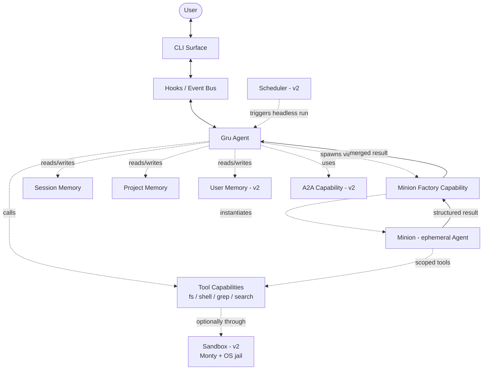
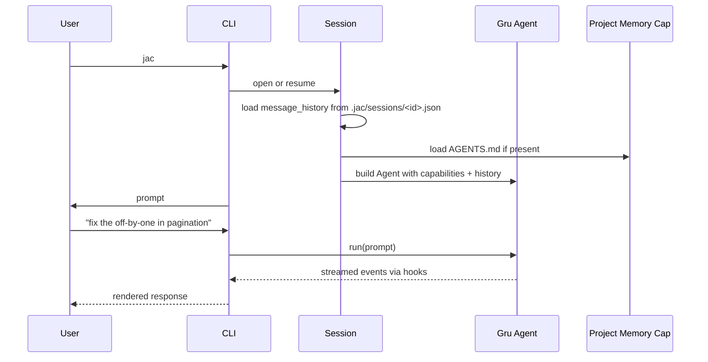
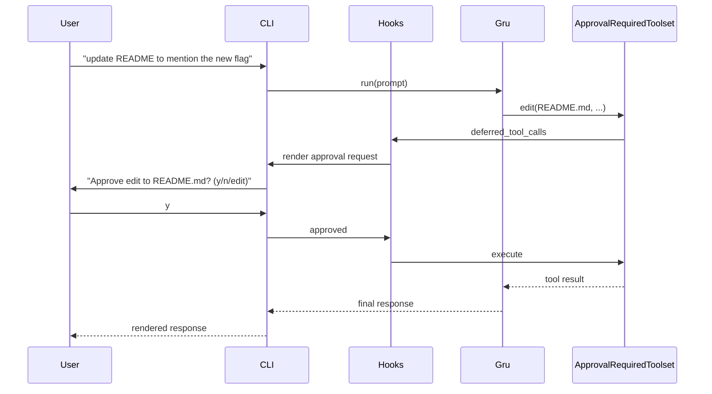
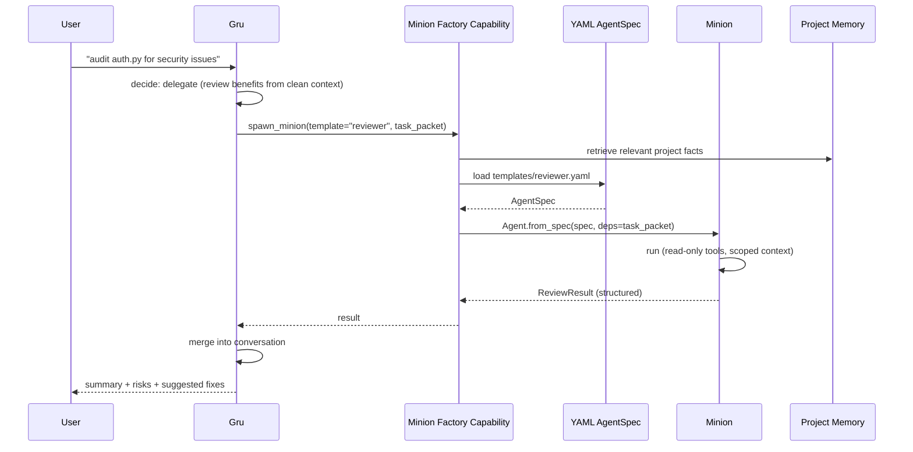
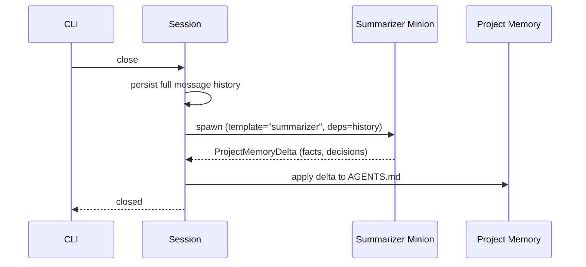
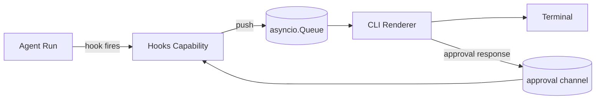
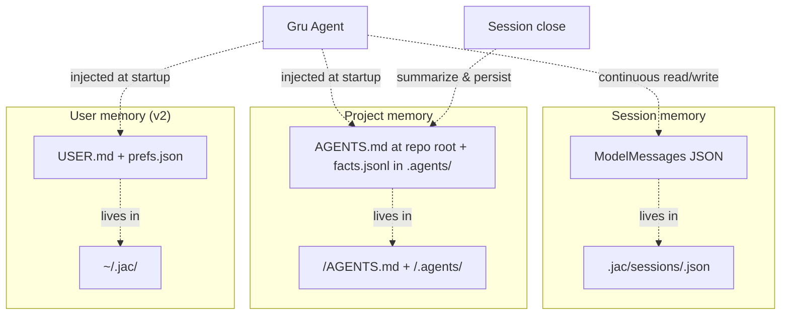
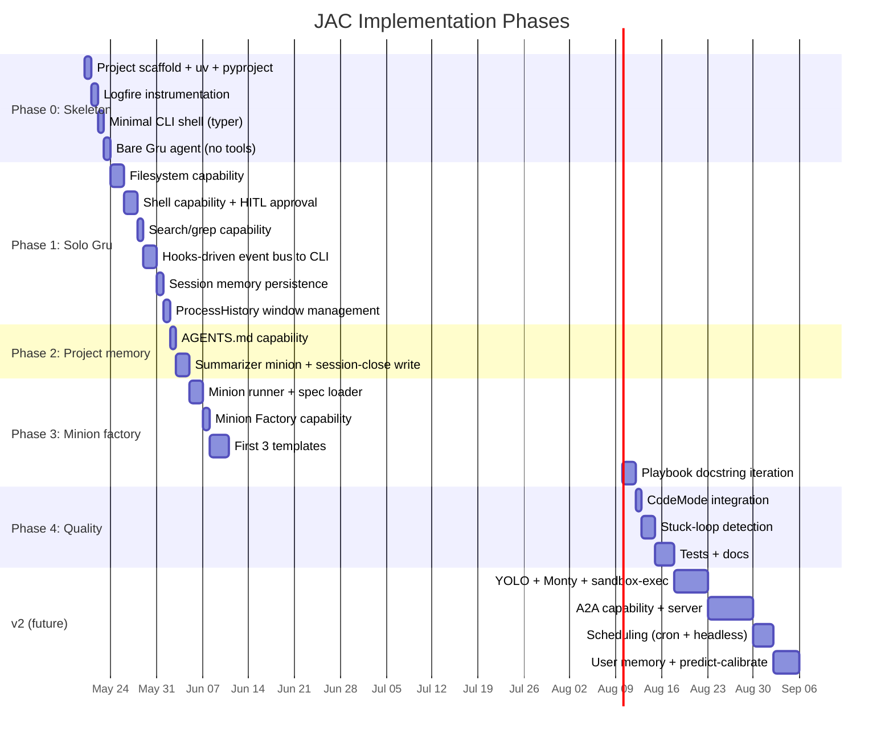

# JAC — ARCHITECTURE

> **Status:** Draft v1 · **Last revised:** 2026-05-19 · **Type:** living design doc
> Edit freely. Diagrams render in GitHub, VS Code (with Mermaid extension), and Cursor.

This is a living document. Where a decision is settled, it's stated as a decision. Where it's still open, it's marked **OPEN**.

## 1. System overview

JAC is a thin orchestration layer over Pydantic AI. The model and the agent loop are Pydantic AI's. JAC's contribution is: persona (Gru), packaged capabilities, a minion factory, a CLI surface, and tier-aware memory.



**Bold idea:** every box that isn't `Gru`, `Minion`, or `CLI` is a **Pydantic AI Capability**. Capabilities are the atom of the system.

## 2. How JAC maps to Pydantic AI

| JAC concept | Pydantic AI primitive | Notes |
| --- | --- | --- |
| **Gru** | `Agent` (long-lived) | One per session. Built once with capability list. |
| **Minion** | `Agent.from_spec()` | Short-lived. Loaded from YAML per task. |
| **Minion template** | `AgentSpec` YAML file | Stored in `minions/templates/`. |
| **Minion Factory** | Custom `Capability` | Exposes `spawn_minion(template, task)` tool to Gru. |
| **Tool bundles** | Custom `Capability` providing `FunctionToolset` | One capability per concern (fs, shell, grep). |
| **HITL approval** | `ApprovalRequiredToolset` + `deferred_tool_calls` hook | Built-in. Tools we mark `approval_required` defer; CLI handles the prompt. |
| **CLI event bus** | `Hooks` (`event`, `before_*`, `deferred_tool_calls`) | CLI registers a `Hooks` capability that pushes lifecycle events to a UI queue. |
| **Session memory** | `ModelMessagesTypeAdapter` + custom disk capability | Pure serialization; storage is our responsibility. |
| **Project memory** | Custom `Capability` with `get_instructions()` | Auto-injects `<repo>/AGENTS.md` (at repo root, community convention) into the system prompt. |
| **Sliding window / summarization** | `ProcessHistory` capability | Built-in. We supply the processor function. |
| **Cheap routing decisions** | `pydantic_ai.direct.model_request_sync` | For "should Gru delegate?" classification. No agent loop needed. |
| **CodeMode** | `CodeMode` capability from `pydantic-ai-harness` | Drop-in. Pulls in Monty automatically. |
| **Tracing** | `Instrumentation` capability + Logfire | One-line setup. |
| **YOLO sandbox (v2)** | Custom `Capability` wrapping shell tool with Monty + `sandbox-exec`/`bwrap` | Behaves transparently to Gru. |
| **A2A — outbound (v2)** | `fasta2a` (PAI's externalized A2A server) wrapped as a capability | Exposes Gru on an A2A endpoint. See [PAI A2A integration docs](https://pydantic.dev/docs/ai/integrations/a2a/). |
| **A2A — inbound (v2)** | Bespoke HTTP client toolset | `fasta2a` is server-only; we build the "call a remote Gru" tool ourselves. It's small. |
| **Scheduling (v2)** | External cron → `jac run --headless` | No internal scheduler needed. |

## 3. Module layout (proposed)

```
jac/
├── pyproject.toml
├── src/jac/
│   ├── __init__.py
│   ├── cli/                      # CLI surface
│   │   ├── app.py                # entry point (typer/click)
│   │   ├── repl.py               # interactive loop
│   │   ├── approval.py           # HITL approval prompt UI
│   │   └── events.py             # subscribes to runtime events
│   ├── runtime/                  # core
│   │   ├── gru.py                # builds the Gru Agent
│   │   ├── session.py            # session lifecycle, persistence
│   │   └── bus.py                # event bus glue between hooks and CLI
│   ├── capabilities/             # all JAC-specific capabilities
│   │   ├── memory/
│   │   │   ├── session.py        # save/load message history
│   │   │   ├── project.py        # inject AGENTS.md
│   │   │   └── user.py           # v2
│   │   ├── tools/
│   │   │   ├── filesystem.py     # read, write, edit
│   │   │   ├── shell.py          # exec
│   │   │   └── search.py         # grep, glob
│   │   ├── factory/
│   │   │   ├── minion_factory.py # exposes spawn_minion(...)
│   │   │   └── playbooks.py      # docstring guidance for Gru
│   │   ├── stuck_loop.py         # detect A-B-A-B tool loops
│   │   └── observability.py      # Logfire wiring
│   ├── minions/
│   │   ├── templates/            # YAML AgentSpec files
│   │   │   ├── researcher.yaml
│   │   │   ├── builder.yaml
│   │   │   ├── reviewer.yaml
│   │   │   ├── tester.yaml
│   │   │   └── summarizer.yaml
│   │   └── runner.py             # loads spec, runs sub-agent, returns result
│   ├── prompts/
│   │   └── gru_system.md         # Gru's base system prompt
│   └── config/
│       └── defaults.yaml         # default model, approval rules, paths
└── tests/
```

**OPEN:** name of the user-facing CLI command. `jac` is the obvious choice.

## 4. Key data flows

### 4a. Session start → first turn



### 4b. Gru works directly (HITL on a sensitive tool)



### 4c. Gru delegates to a minion



### 4d. Session close → memory write



**OPEN:** whether to write incrementally during the session or only at close. Tentative: close-only for v1, opportunistic mid-session for v2 (predict-calibrate).

## 5. Anatomy of a Minion

A minion is just an `AgentSpec` (YAML) instantiated for a single task. Sketch:

```yaml
# minions/templates/reviewer.yaml
model: anthropic:claude-sonnet-4-5
name: reviewer
description: Reviews code/diffs for bugs, regressions, missing tests, and risk.
instructions: |
  You review code with a critical eye. You do not implement fixes.
  Output a structured report: findings (severity, location, rationale),
  missing tests, and suggested follow-ups.
  You have read-only tools. Do not write or execute anything.
deps_schema:
  type: object
  properties:
    # Standard task packet fields (see §5a)
    objective: {type: string}
    success_criteria: {type: array, items: {type: string}}
    relevant_files: {type: array, items: {type: string}}
    forbidden_actions: {type: array, items: {type: string}}
    expected_output: {type: string}
    # Template-specific extension fields
    review_criteria: {type: array, items: {type: string}}
  required: [objective, success_criteria, expected_output]
output_schema:
  type: object
  properties:
    findings:
      type: array
      items:
        type: object
        properties:
          severity: {type: string, enum: [low, medium, high, critical]}
          location: {type: string}
          rationale: {type: string}
    missing_tests: {type: array, items: {type: string}}
    follow_ups: {type: array, items: {type: string}}
  required: [findings]
capabilities:
  - ReadOnlyFilesystem    # custom JAC capability
  - Grep
  - Thinking: {effort: medium}
end_strategy: early
tool_timeout: 30
```

### 5a. Task packet schema (locked)

Every minion receives a task packet via `deps`. The core schema is locked — templates may extend it with their own fields, but these stay stable across the system:

| Field | Type | Required | Purpose |
| --- | --- | --- | --- |
| `objective` | string | yes | What the minion must accomplish, in one sentence |
| `success_criteria` | list[string] | yes | How the minion (and we) know it's done |
| `relevant_files` | list[string] | no | Files the minion should focus on |
| `forbidden_actions` | list[string] | no | Specific actions the minion must not perform |
| `expected_output` | string | yes | Description (or JSONSchema) of the return shape |

The factory builds the packet from Gru's intent + retrieved memory. Templates can declare additional `deps_schema` fields beyond these five. Extensible — add fields without breaking old templates.

### 5b. The Minion Factory's job is to:

1. Validate template exists.
2. Build the `task_packet` (deps) from Gru's request + retrieved memory.
3. `Agent.from_spec("templates/reviewer.yaml", custom_capability_types=[...])`.
4. Run the sub-agent.
5. Return the structured output to Gru.

Gru never sees the minion's internal turns — only the structured result. This is the **context refinery** in concrete terms.

## 6. Anatomy of the Minion Factory (capability)

Sketch — not final code:

```python
from dataclasses import dataclass
from pydantic_ai import Agent
from pydantic_ai.capabilities import AbstractCapability
from pydantic_ai.toolsets import FunctionToolset

@dataclass
class MinionFactory(AbstractCapability):
    template_dir: Path
    custom_capability_types: list[type] = field(default_factory=list)

    def get_toolset(self):
        ts = FunctionToolset()

        @ts.tool
        async def spawn_minion(ctx, template: str, task: dict) -> dict:
            """
            Spawn a temporary worker. Templates: researcher, builder,
            reviewer, tester, summarizer.

            Use this when: you need clean context isolation, an
            independent reviewer, or a cheaper model for a bounded
            subtask. Don't use it for trivial work — just do it yourself.
            """
            spec_path = self.template_dir / f"{template}.yaml"
            minion = Agent.from_spec(
                spec_path,
                custom_capability_types=self.custom_capability_types,
            )
            result = await minion.run(task["objective"], deps=task)
            return result.output

        return ts
```

The **docstring is the playbook for v1**. It's what Gru reads to decide when to spawn. Static, simple, good enough.

**Escalation path:** if static guidance proves insufficient, the factory can use `model_request_sync` (direct API) with a cheap model to *recommend* whether/how to delegate before exposing the decision to Gru. Deferred to later.

## 6a. Tool calls must carry a reason

**Every tool exposed to Gru or a minion must accept a `reason: str` parameter as its first argument.** The LLM is required to provide a one-sentence justification for each call.

Why this is non-negotiable:

- **User UX:** the approval prompt shows *why* the tool wants to run, not just *what* it'll do. Drastically better than "approve `edit(file=...)`? y/n".
- **Soft alignment:** an LLM that has to justify a call before making it is measurably more deliberate.
- **Audit trail:** every traced tool call records its stated reason alongside its arguments. Debuggability is much higher.

**Enforcement** — done structurally, not by trusting the system prompt:

- A `JacTool` decorator that requires the `reason` parameter at registration time.
- A `WrapperToolset` that rejects tool definitions missing the parameter at agent construction (fail-fast, not at runtime).
- The `before_tool_execute` hook surfaces the reason on the approval channel.

This applies uniformly: filesystem tools, shell tools, memory writes, `spawn_minion`, search — all of them. The pattern is cheap and pays off everywhere.

```python
@jac_tool
def edit_file(reason: str, path: str, old: str, new: str) -> str:
    """Edit a file by replacing `old` with `new`. `reason` is required."""
    ...
```

The CLI's approval prompt then renders:

```
[edit_file]  src/auth/login.py
  reason: Fix the off-by-one in pagination by replacing `< total` with `<= total`.
  diff:    -    if page * size < total:
           +    if page * size <= total:
  Approve? [y/n/edit/why]
```

## 7. CLI ↔ runtime communication

**Stack:** `typer` (command parsing) + `rich` (rendering: panels, syntax, tables) + [`prompt-toolkit`](https://python-prompt-toolkit.readthedocs.io/) (interactive input: multi-line editing, history, completion, key bindings).

The CLI does **not** poll the agent. Instead:

1. CLI builds a `Hooks` capability with subscriptions to `event`, `before_tool_execute`, `deferred_tool_calls`, `before_model_request`, `after_model_request`.
2. Each hook pushes a typed event onto an `asyncio.Queue`.
3. The CLI's render loop consumes the queue and updates the UI.
4. `deferred_tool_calls` events become approval prompts; the CLI's response goes back through `DeferredToolResults`.

This means: **the CLI is just a presenter; all logic stays in capabilities**. Different surfaces (TUI, web, API) reuse the same capability set with different presenters. Surface-independence falls out for free.



## 8. Memory subsystem detail

Three tiers, three capabilities, three storage locations:



- **Session:** raw `ModelMessage` list, JSON via `ModelMessagesTypeAdapter`. Stored under `.jac/sessions/<timestamp>/` (folder convention — sorts chronologically, human-readable). Resumable via `message_history=` parameter.
- **Project:** starts as just `AGENTS.md` (prose). Auto-injected on every Gru run via a `ProjectMemory` capability's `get_instructions()`. Updated at session close by a summarizer minion. **Structured `facts.jsonl` is added only if/when prose retrieval gets noisy** — memory management is a last resort, not a first move.
- **User:** v2. Same shape, scoped to `~/.jac/`.

**Predict-calibrate (v2):** at session close, the summarizer minion is given existing project memory + new session transcript. It predicts what the project memory *should* now say; the diff is what gets written. Avoids duplicate facts and stale overwrites. Steal from `memv`.

## 9. Phased roadmap

The phases are now far smaller than the original IDEA.md implied, because most plumbing is already shipped in `pydantic-ai` and `pydantic-ai-harness`.



Dates are illustrative — they show *order* and *relative size*, not commitments.

**Critical path to "JAC works":** Phase 0 + Phase 1. Roughly 1–2 weeks of focused work. That alone is a usable Claude-Code-lite.

**Critical path to "JAC is interesting":** Phase 0 + 1 + 2 + 3. Adds the multi-agent story.

**Critical path to "JAC is differentiated":** Phase 0–4 then v2 A2A. The headline feature lives in v2 and depends on a stable v1 foundation.

## 10. User journeys

Five canonical journeys we should design against. If any of these feel wrong, the architecture is wrong.

### J1: First-time use in an unfamiliar repo

1. User `cd`s into a repo and runs `jac`.
2. No `.jac/` exists. Gru introduces itself, runs a one-shot scan (read top-level structure + README), asks 2–3 clarifying questions about the project.
3. User answers. Gru writes initial `AGENTS.md`.
4. Loop ready for normal interaction.

### J2: Simple ask, single turn

1. User: "what does `compute_hash` do in utils.py?"
2. Gru reads the file, answers. No tools that mutate, no minions.

### J3: Scoped bug fix with HITL

1. User: "fix the off-by-one in pagination".
2. Gru searches, identifies, proposes a diff in chat first.
3. Gru calls `edit()` — approval prompt fires.
4. User approves. Gru runs the test suite via `shell()` — approval fires.
5. User approves. Test passes. Gru reports.

### J4: Ambiguous build, Gru delegates

1. User: "audit auth.py for security issues and propose fixes".
2. Gru decides to delegate the audit to a `reviewer` minion (clean context wins).
3. Reviewer returns structured findings.
4. Gru reviews findings, may delegate fix implementation to a `builder` minion per finding.
5. Each fix proposal is presented to user for approval before edit.

### J5: Resume after time

1. User comes back next morning, runs `jac` in same repo.
2. Session memory + project memory load.
3. Gru greets with: "last session you were working on X, status was Y. Continue?"
4. Loop resumes.

## 11. Decisions made

These were open in the previous draft; now locked.

| # | Decision |
| --- | --- |
| D1 | **Minion task packet:** `objective` (req), `success_criteria` (req), `relevant_files` (opt), `forbidden_actions` (opt), `expected_output` (req). Templates may extend with their own fields. See §5a. |
| D2 | **Approval granularity:** per-tool, with an optional `risk: high` tag for one-off escalation. **Every tool call carries a `reason: str`** that is rendered in the approval UI. See §6a. |
| D3 | **Session ID:** timestamp folder. `.jac/sessions/2026-05-19T16-23-04/`. Human-readable, sorts chronologically, trivially scriptable. |
| D4 | **Project memory:** prose `AGENTS.md` first. Add structured `facts.jsonl` only if/when prose retrieval gets noisy. Memory management is a last resort. |
| D5 | **Skills location (v2 feature):** both project (`<repo>/.agents/skills/`) and user (`~/.jac/skills/`). Project entries shadow user entries on name collision. |
| D6 | **CLI stack:** `typer` (commands) + `rich` (rendering) + `prompt-toolkit` (interactive input loop). |
| D7 | **A2A:** use `fasta2a` for server-side exposure; build a small bespoke HTTP client toolset for outbound calls. Both wrapped as JAC capabilities. v2. |
| D8 | **Tracing schema:** every Logfire span carries `template`, `task_id`, `parent_run_id`, `token_cost`, `duration`, `exit_status`. |
| D9 | **Config layering:** package defaults → user (`~/.jac/`) → project (`<repo>/.agents/`) → env vars → CLI args. Required values without an override raise `JacConfigError` — never silent defaults. |
| D10 | **File-format standards:** **YAML** for app config *and* agent/minion specs (one format for all human-edited structured data); **JSON / JSONL** for machine state; **Markdown** for prose; **dotenv** for secrets. |
| D11 | **Workspace layout:** user workspace at `~/.jac/`, project workspace at `<repo>/.agents/`. Symmetric subdirs (`prompts/`, `minions/templates/`, `skills/`). Sessions live at project scope only. Project shadows user shadows package defaults. **AGENTS.md** (community convention) lives at `<repo>/AGENTS.md` (root, not inside `.agents/`) and at `~/.jac/AGENTS.md`; both are auto-loaded into Gru's instructions when present. |
| D12 | **No hardcoded defaults for required runtime values.** No model default in code; the user must configure one via env, CLI flag, or config file. Prompts and minion templates ship with package defaults but may be overridden at the user or project workspace. |

### Still open (smaller calls, deferrable)

- Default model selection per minion template (anthropic? openai? per-template override? env-var fallback?).
- Whether session memory persistence should include tool outputs verbatim or summaries (cost vs. fidelity trade-off — likely verbatim until size becomes a problem).
- Which tools default to `risk: high` (shell-execute and `delete_file` are obvious; the full list needs a pass).
- Exact format of the approval prompt response — `y/n/edit/why` or fewer options?

## 12. References

### Pydantic AI docs (loaded into our understanding)

- [Agent specs](https://pydantic.dev/docs/ai/core-concepts/agent-spec/) — YAML-defined agents
- [Message history](https://pydantic.dev/docs/ai/core-concepts/message-history/) — persistence, processors
- [Direct LLM calls](https://pydantic.dev/docs/ai/core-concepts/direct/) — no-agent-loop API
- [Hooks](https://pydantic.dev/docs/ai/core-concepts/hooks/) — full lifecycle event system
- [Capabilities](https://pydantic.dev/docs/ai/core-concepts/capabilities/) — primary extension mechanism
- [Extensibility](https://pydantic.dev/docs/ai/guides/extensibility/) — packaging extensions
- [Toolsets](https://pydantic.dev/docs/ai/tools-toolsets/toolsets/) — including `ApprovalRequiredToolset`

### Cloned reference projects (in `~/Projects/personal/JAC-research/`)

- `pydantic-ai-harness/` — official capability library (CodeMode, etc.)
- `pydantic-deepagents/` — closest analog; steal stuck-loop detection, orphan repair
- `pydantic-ai-backend/` — console toolset + Docker sandbox patterns
- `memv/` — predict-calibrate memory
- `monty/` — sandbox runtime (v2 YOLO)
- `pi/` — multi-package harness; skill-authoring pattern
