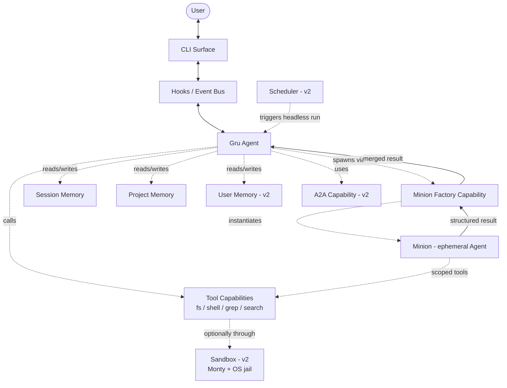
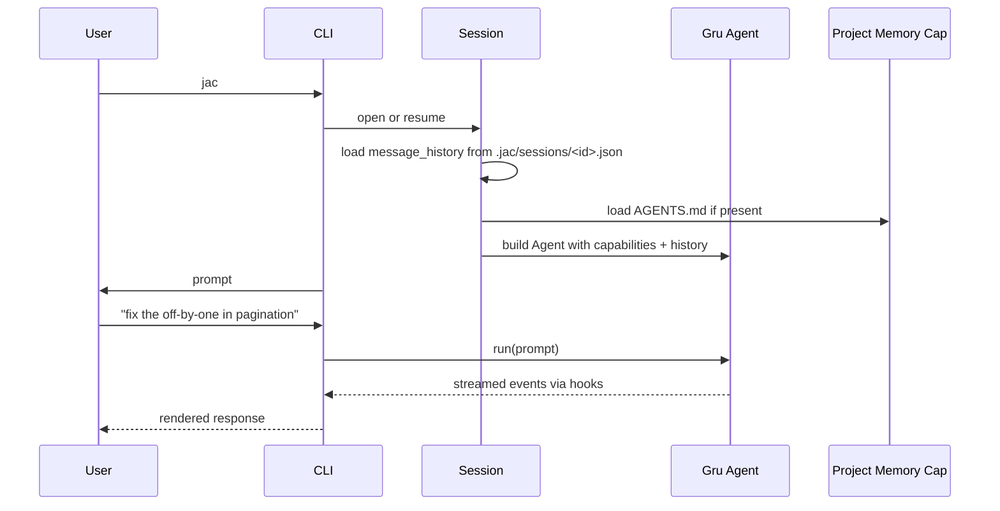
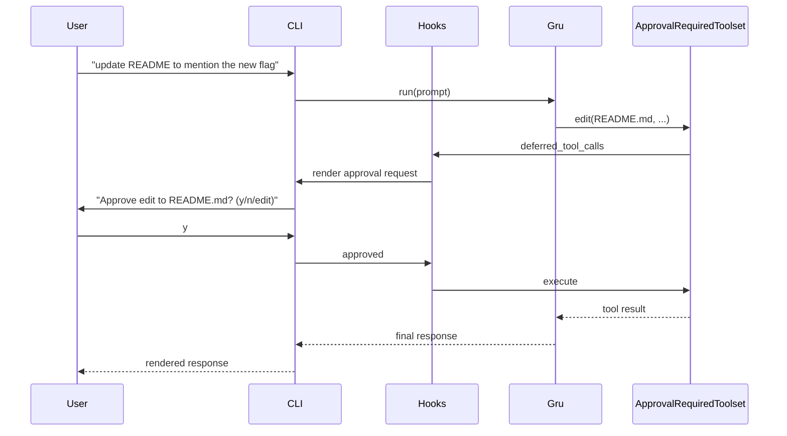
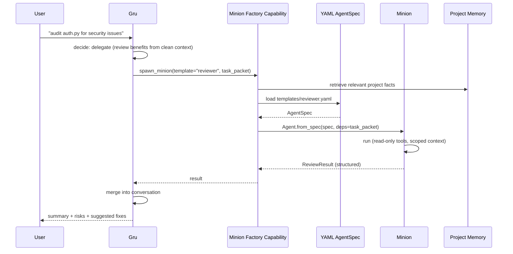
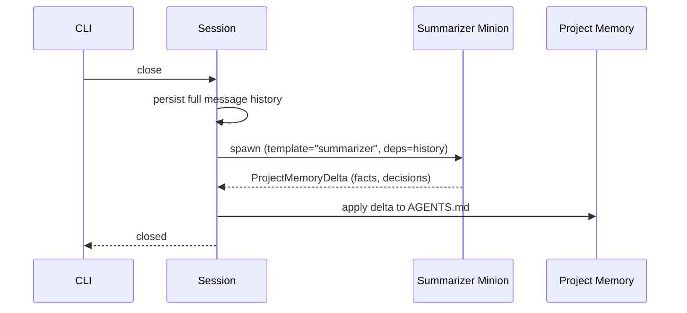
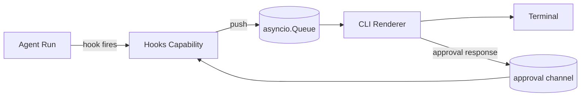
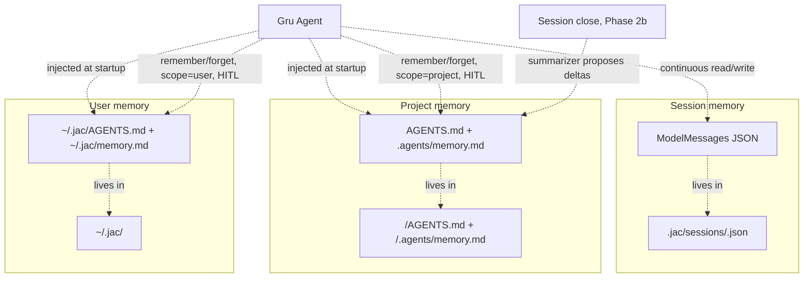
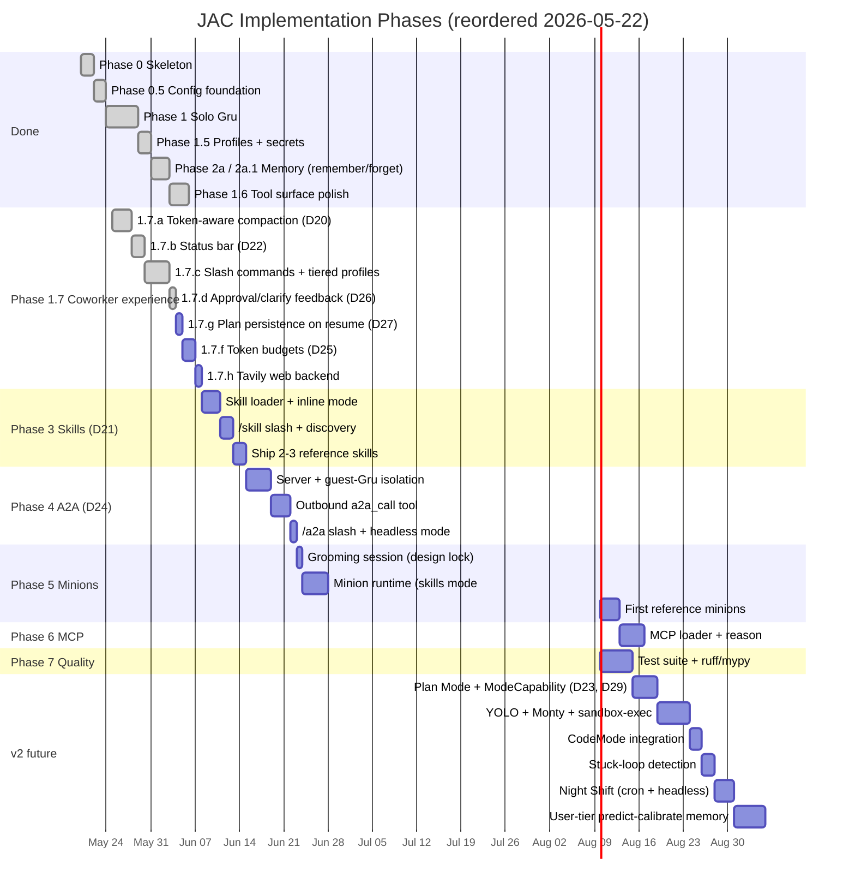

# JAC — ARCHITECTURE

> **Status:** Draft v1 · **Last revised:** 2026-05-19 · **Type:** living design doc
> Edit freely. Diagrams render in GitHub, VS Code (with Mermaid extension), and Cursor.

This is a living document. Where a decision is settled, it's stated as a decision. Where it's still open, it's marked **OPEN**.

## 1. System overview

JAC (**J**ust **A**nother **C**ompanion/CLI) is a thin orchestration layer over Pydantic AI. The model and the agent loop are Pydantic AI's. JAC's contribution is: persona (Gru), packaged capabilities, a minion factory, a CLI surface, and tier-aware memory.



**Bold idea:** every box that isn't `Gru`, `Minion`, or `CLI` is a **Pydantic AI Capability**. Capabilities are the atom of the system.

## 2. How JAC maps to Pydantic AI

| JAC concept | Pydantic AI primitive | Notes |
| --- | --- | --- |
| **Gru** | `Agent` (long-lived) | One per session. Built once with capability list. Model selected by *tier* via active profile (D22), not hardcoded. |
| **Minion** | `Agent` instantiated from a skill (`mode: minion`) | Short-lived. Loaded from a community-format skill file (D21). Replaces the old `AgentSpec` YAML path. |
| **Skill (inline mode)** | Markdown + YAML frontmatter | Loaded via custom `SkillsCapability`; description-triggered or `/skill NAME` forced. Adopts the [Anthropic skills format](https://www.anthropic.com/news/claude-skills) verbatim — community catalogs install as-is. |
| **Skill (minion mode)** | Same file + `mode: minion` + `output_schema:` | The skill body becomes the sub-agent's instructions; `tools:` scopes the toolset; the minion factory orchestration sits on this. Minion runtime needs a separate grooming session before Phase 4. |
| **Tool bundles** | Custom `Capability` providing `FunctionToolset` | One capability per concern (fs, shell, grep). |
| **HITL approval** | `ApprovalRequiredToolset` + `deferred_tool_calls` hook | Built-in. Tools we mark `approval_required` defer; CLI handles the prompt. |
| **CLI event bus** | `Hooks` (`event`, `before_*`, `deferred_tool_calls`) | CLI registers a `Hooks` capability that pushes lifecycle events to a UI queue. |
| **Session memory** | `ModelMessagesTypeAdapter` + custom disk capability | Pure serialization; storage is our responsibility. |
| **Project memory** | Custom `Capability` with `get_instructions()` | Auto-injects `<repo>/AGENTS.md` (at repo root, community convention) into the system prompt. |
| **Sliding window / summarization** | `ProcessHistory` capability | Built-in. We supply the processor function. |
| **Cheap routing decisions** | `pydantic_ai.direct.model_request_sync` | For "should Gru delegate?" classification. No agent loop needed. |
| **CodeMode** | `CodeMode` capability from `pydantic-ai-harness` | Drop-in. Pulls in Monty automatically. |
| **Tracing** | `Instrumentation` capability + Logfire | One-line setup. |
| **YOLO sandbox (v2)** | Custom `Capability` wrapping shell tool with Monty + `sandbox-exec`/`bwrap` | Behaves transparently to Gru. |
| **A2A — inbound** | `fasta2a` (PAI's A2A server) wrapped as a `Capability`, spawned on a background asyncio task | Exposes JAC on an A2A endpoint. Inbound requests hit an **isolated guest Gru** (D24), not the main session. See [PAI A2A integration docs](https://pydantic.dev/docs/ai/integrations/a2a/) and [A2A protocol spec](https://a2a-protocol.org/latest/). |
| **A2A — outbound** | Custom toolset around the A2A HTTP protocol | `a2a_call(reason, url, message)` — talks to any A2A-compatible agent, not just other JAC instances (D24). |
| **Plan Mode (v2)** | `PlanMode` capability — toolset swap + prompt overlay | Structurally enforces read-only-plus-`write_plan` (D23). Deferred to v2 — see §11 D23 status note. |
| **Mode swap mechanism** | Toolset filter at construction time | One `ModeCapability` base; future modes (YOLO, review-only) reuse the same swap pattern. |
| **Scheduling (v2)** | External cron → `jac run --headless` | No internal scheduler needed. |

## 3. Module layout (proposed)

```
jac/
├── pyproject.toml
├── src/jac/
│   ├── __init__.py
│   ├── cli/                      # CLI surface
│   │   ├── app.py                # entry point (typer)
│   │   ├── repl.py               # interactive loop
│   │   ├── renderer.py           # Rich rendering + approval/clarify UI
│   │   ├── statusbar.py          # bottom_toolbar provider (D22 status display)
│   │   ├── slash/                # slash command handlers (D22+ — share internals with CLI subcommands)
│   │   │   ├── registry.py       # discovery + completer source
│   │   │   ├── model.py          # /model, /profile (tier-aware)
│   │   │   ├── compact.py        # /compact, /clear
│   │   │   ├── plan.py           # /plan, /approve, /cancel (Plan Mode entry — v2)
│   │   │   ├── budget.py         # /budget, /tokens
│   │   │   └── a2a.py            # /a2a serve, /a2a stop
│   │   ├── init.py               # interactive setup wizard
│   │   ├── profiles_cmd.py       # `jac profiles`
│   │   └── keys_cmd.py           # `jac keys`
│   ├── runtime/                  # core
│   │   ├── gru.py                # builds the Gru Agent (tier-aware)
│   │   ├── session.py            # session lifecycle, persistence
│   │   ├── session_ctx.py        # ContextVar for current session id
│   │   ├── bus.py                # event bus glue between hooks and CLI
│   │   ├── events.py             # typed event union
│   │   └── usage.py              # token tracking (D25 budgets)
│   ├── capabilities/             # all JAC-specific capabilities
│   │   ├── hooks.py              # event bus producer
│   │   ├── approval.py           # HITL + denied-with-feedback (D26)
│   │   ├── clarify.py            # structured prompt + free-text option (D26)
│   │   ├── history.py            # token-aware compaction (D20)
│   │   ├── memory.py             # remember / forget (D14)
│   │   ├── plan.py               # in-session checklist (D15) — renamed to tasks.py once D23 ships
│   │   ├── filesystem.py         # read, write, edit
│   │   ├── search.py             # grep, glob
│   │   ├── shell.py              # exec
│   │   ├── process.py            # background processes
│   │   ├── web.py                # web_search (Tavily → DDG fallback) + fetch_url
│   │   ├── skills.py             # skill loader + inline-mode injection (D21)
│   │   ├── minion_factory.py     # mode:minion runtime — *queued, grooming pending*
│   │   ├── modes/                # v2 — ModeCapability base + Plan Mode (D23) + YOLO (D29 sketch)
│   │   │   ├── base.py           # ModeCapability base — toolset filter + prompt overlay
│   │   │   └── plan_mode.py      # Plan Mode (D23)
│   │   ├── a2a/                  # D24 — Phase 4
│   │   │   ├── __init__.py       # A2ACapability (public surface; outbound tools + server lifecycle)
│   │   │   ├── server.py         # FastA2A wrapper + background asyncio lifecycle
│   │   │   ├── guest.py          # build_guest_gru() — narrowed toolset + project context, no session
│   │   │   ├── auth.py           # BearerAuthMiddleware + ephemeral token generation
│   │   │   ├── card.py           # AgentCard auto-generation from profile + skill
│   │   │   ├── storage.py        # JacFileStorage(fasta2a.Storage) — persists contexts to disk
│   │   │   ├── audit.py          # inbound.jsonl writer + retention cleanup
│   │   │   └── client.py         # outbound tools: a2a_call + a2a_discover
│   │   └── observability.py      # Logfire wiring
│   ├── profiles.py               # profile schema (tiered models — D22)
│   ├── secrets.py                # keyring/dotenv/env-only backends
│   ├── providers/                # provider catalog (D19)
│   ├── workspace/                # paths, config_loader, context, bootstrap
│   ├── tools/                    # @jac_tool decorator + jac_function_toolset
│   ├── prompts/
│   │   ├── gru_system.md         # Gru's base system prompt
│   │   └── plan_mode.md          # Plan Mode prompt overlay (D23 — v2)
│   └── data/
│       ├── defaults.yaml         # non-required Settings tunables
│       ├── providers.yaml        # provider catalog
│       └── skills/               # any *shipped* skills (community-format)
└── tests/
```

Layout note: `slash/`, `modes/`, `a2a/`, `usage.py`, `statusbar.py`, `skills.py` are *planned* and tied to the phases in §9 — they don't all exist yet. The currently-shipping shape is reflected by what's in `src/jac/` on disk; this diagram is the target.

## 4. Key data flows

### 4a. Session start → first turn



### 4b. Gru works directly (HITL on a sensitive tool)



### 4c. Gru delegates to a minion



### 4d. Session close → memory write



**OPEN:** whether to write incrementally during the session or only at close. Tentative: close-only for v1, opportunistic mid-session for v2 (predict-calibrate).

## 5. Anatomy of a Minion

A minion is just an `AgentSpec` (YAML) instantiated for a single task. Sketch:

```yaml
# minions/templates/reviewer.yaml
model: anthropic:claude-sonnet-4-5
name: reviewer
description: Reviews code/diffs for bugs, regressions, missing tests, and risk.
instructions: |
  You review code with a critical eye. You do not implement fixes.
  Output a structured report: findings (severity, location, rationale),
  missing tests, and suggested follow-ups.
  You have read-only tools. Do not write or execute anything.
deps_schema:
  type: object
  properties:
    # Standard task packet fields (see §5a)
    objective: {type: string}
    success_criteria: {type: array, items: {type: string}}
    relevant_files: {type: array, items: {type: string}}
    forbidden_actions: {type: array, items: {type: string}}
    expected_output: {type: string}
    # Template-specific extension fields
    review_criteria: {type: array, items: {type: string}}
  required: [objective, success_criteria, expected_output]
output_schema:
  type: object
  properties:
    findings:
      type: array
      items:
        type: object
        properties:
          severity: {type: string, enum: [low, medium, high, critical]}
          location: {type: string}
          rationale: {type: string}
    missing_tests: {type: array, items: {type: string}}
    follow_ups: {type: array, items: {type: string}}
  required: [findings]
capabilities:
  - ReadOnlyFilesystem    # custom JAC capability
  - Grep
  - Thinking: {effort: medium}
end_strategy: early
tool_timeout: 30
```

### 5a. Task packet schema (locked)

Every minion receives a task packet via `deps`. The core schema is locked — templates may extend it with their own fields, but these stay stable across the system:

| Field | Type | Required | Purpose |
| --- | --- | --- | --- |
| `objective` | string | yes | What the minion must accomplish, in one sentence |
| `success_criteria` | `list[string]` | yes | How the minion (and we) know it's done |
| `relevant_files` | `list[string]` | no | Files the minion should focus on |
| `forbidden_actions` | `list[string]` | no | Specific actions the minion must not perform |
| `expected_output` | string | yes | Description (or JSONSchema) of the return shape |

The factory builds the packet from Gru's intent + retrieved memory. Templates can declare additional `deps_schema` fields beyond these five. Extensible — add fields without breaking old templates.

### 5b. The Minion Factory's job is to:

1. Validate template exists.
2. Build the `task_packet` (deps) from Gru's request + retrieved memory.
3. `Agent.from_spec("templates/reviewer.yaml", custom_capability_types=[...])`.
4. Run the sub-agent.
5. Return the structured output to Gru.

Gru never sees the minion's internal turns — only the structured result. This is the **context refinery** in concrete terms.

## 6. Anatomy of the Minion Factory (capability)

Sketch — not final code:

```python
from dataclasses import dataclass
from pydantic_ai import Agent
from pydantic_ai.capabilities import AbstractCapability
from pydantic_ai.toolsets import FunctionToolset

@dataclass
class MinionFactory(AbstractCapability):
    template_dir: Path
    custom_capability_types: list[type] = field(default_factory=list)

    def get_toolset(self):
        ts = FunctionToolset()

        @ts.tool
        async def spawn_minion(ctx, template: str, task: dict) -> dict:
            """
            Spawn a temporary worker. Templates: researcher, builder,
            reviewer, tester, summarizer.

            Use this when: you need clean context isolation, an
            independent reviewer, or a cheaper model for a bounded
            subtask. Don't use it for trivial work — just do it yourself.
            """
            spec_path = self.template_dir / f"{template}.yaml"
            minion = Agent.from_spec(
                spec_path,
                custom_capability_types=self.custom_capability_types,
            )
            result = await minion.run(task["objective"], deps=task)
            return result.output

        return ts
```

The **docstring is the playbook for v1**. It's what Gru reads to decide when to spawn. Static, simple, good enough.

**Escalation path:** if static guidance proves insufficient, the factory can use `model_request_sync` (direct API) with a cheap model to *recommend* whether/how to delegate before exposing the decision to Gru. Deferred to later.

## 6a. Tool calls must carry a reason

**Every tool exposed to Gru or a minion must accept a `reason: str` parameter as its first argument.** The LLM is required to provide a one-sentence justification for each call.

Why this is non-negotiable:

- **User UX:** the approval prompt shows *why* the tool wants to run, not just *what* it'll do. Drastically better than "approve `edit(file=...)`? y/n".
- **Soft alignment:** an LLM that has to justify a call before making it is measurably more deliberate.
- **Audit trail:** every traced tool call records its stated reason alongside its arguments. Debuggability is much higher.

**Enforcement** — done structurally, not by trusting the system prompt:

- A `JacTool` decorator that requires the `reason` parameter at registration time.
- A `WrapperToolset` that rejects tool definitions missing the parameter at agent construction (fail-fast, not at runtime).
- The `before_tool_execute` hook surfaces the reason on the approval channel.

This applies uniformly: filesystem tools, shell tools, memory writes, `spawn_minion`, search — all of them. The pattern is cheap and pays off everywhere.

```python
@jac_tool
def edit_file(reason: str, path: str, old: str, new: str) -> str:
    """Edit a file by replacing `old` with `new`. `reason` is required."""
    ...
```

The CLI's approval prompt then renders:

```
[edit_file]  src/auth/login.py
  reason: Fix the off-by-one in pagination by replacing `< total` with `<= total`.
  diff:    -    if page * size < total:
           +    if page * size <= total:
  Approve? [y/n/edit/why]
```

## 7. CLI ↔ runtime communication

**Stack:** `typer` (command parsing) + `rich` (rendering: panels, syntax, tables) + [`prompt-toolkit`](https://python-prompt-toolkit.readthedocs.io/) (interactive input: multi-line editing, history, completion, key bindings).

The CLI does **not** poll the agent. Instead:

1. CLI builds a `Hooks` capability with subscriptions to `event`, `before_tool_execute`, `deferred_tool_calls`, `before_model_request`, `after_model_request`.
2. Each hook pushes a typed event onto an `asyncio.Queue`.
3. The CLI's render loop consumes the queue and updates the UI.
4. `deferred_tool_calls` events become approval prompts; the CLI's response goes back through `DeferredToolResults`.

This means: **the CLI is just a presenter; all logic stays in capabilities**. Different surfaces (TUI, web, API) reuse the same capability set with different presenters. Surface-independence falls out for free.



## 8. Memory subsystem detail

Three tiers, three capabilities, three storage locations:



- **Session:** raw `ModelMessage` list, JSON via `ModelMessagesTypeAdapter`. Stored under `<repo>/.agents/sessions/<timestamp>/` (folder convention — sorts chronologically, human-readable). Resumable via `message_history=` parameter.
- **Project + User (2×2 matrix):** memory has two axes — *who authored the file* and *which scope it covers*. Both axes are loaded into Gru's instructions on every run.
  - **Read side (user-authored, we never mutate):** `~/.jac/AGENTS.md` for cross-project context, `<repo>/AGENTS.md` for repo-specific context.
  - **Read side (JAC-managed, we write to):** `~/.jac/memory.md` for facts that follow the user across every project, `<repo>/.agents/memory.md` for facts about this repo only. Both lazily bootstrapped from a shared template (5 fixed `##` sections matching the 5 categories) on first write.
  - **Write side:** Gru calls the **HITL-gated `remember(reason, content, category, scope)` tool** (`MemoryCapability`) whenever it identifies a durable fact worth keeping; `forget(reason, content, scope)` removes one. `scope` is required and validated — `scope="project"` outside a git repo fails fast rather than scribbling into CWD. Each entry carries `<!-- jac: <timestamp> session: <session-id> -->` for audit. Atomic writes; exact-normalized de-dup against the target section. A soft size warning is surfaced through the tool result past ~25 entries per section. See D14.
  - **Phase 2b (queued):** a summarizer minion that proposes additional deltas at session close, routed through the same `remember` approval path.
  - **Structured `facts.jsonl` is added only if/when prose retrieval gets noisy** — memory management is a last resort, not a first move.
- **User:** the `~/.jac/memory.md` half of the 2×2 already exists (Phase 2a.1). Predict-calibrate extraction over user-tier memory remains v2.

**Predict-calibrate (v2):** at session close, the summarizer minion is given existing project memory + new session transcript. It predicts what the project memory *should* now say; the diff is what gets written. Avoids duplicate facts and stale overwrites. Steal from `memv`.

## 9. Phased roadmap

Reordered 2026-05-22 after a brainstorm pass. The driving principle is **functional + useful + cost-effective + maintainable** — phases are ordered by user-visible value per day of work, not by architectural neatness. Phases 0–1.6 plus 2a/2a.1 are ✅ complete; what follows is current-and-future. The detailed checklist lives in `progress.md`.



Dates are illustrative — they show *order* and *relative size*, not commitments. New since the prior draft:

- **Phase 1.7** is a new umbrella ("Coworker experience") that batches every UX / cost-control change before any new agent-tier work. Status bar + slash commands + compaction + budgets ship together because they share renderer surface area.
- **2026-05-23 reshuffle:** Plan Mode (1.7.e / D23) and the `ModeCapability` base were **deferred to v2** during 1.7.e's brainstorm. Open design questions (multi-plan handoff, plan-injection budget hazard, base-abstraction scope across ≥4 plausible modes) outweighed the slot's appetite. The bundled `plan`→`tasks` rename (D23 naming note + D27) defers with it — current code keeps `PlanCapability` / `plan` tool names / `<session>/plan.json`. Decisions D23 + D29 stay in §11 as the design we'll use; only the *timing* changed. 1.7.g (plan persistence) and 1.7.f (token budgets) now ride immediately after 1.7.d.
- **Phase 2b** (standalone summarizer minion) is **superseded** by Phase 1.7.a — token-aware compaction *is* the summarizer.
- **Phase 3** (formerly "Minion factory" with bespoke YAML AgentSpec templates) is now **Skills** per D21 — adopting the Anthropic community format. Minion runtime moves to a later phase that builds on the skills substrate.
- **Phase 4 A2A** moved out of v2 — it has no hard dependency on minions or skills, and it's the project's headline differentiator. No reason to keep deferring.
- **Phase 5 Minions** explicitly requires a **grooming session** before implementation — D21 locks the *format* (skills with `mode: minion`); the *runtime* (output schema enforcement, tool scoping, factory orchestration, parallelism) is not yet designed.
- **CodeMode + stuck-loop** moved to v2 alongside YOLO — they're either premature (CodeMode) or low-value in HITL (stuck-loop catches the kind of bug a human catches anyway).

**Critical paths (revised):**

- *"JAC is a usable single-agent coworker"* = Phase 0 → 1.6 → 1.7 ✅ +current. This is most of what people will actually use day-to-day.
- *"JAC is an extensible coworker"* = + Phase 3 Skills. Community skills install; JAC isn't an island.
- *"JAC is differentiated"* = + Phase 4 A2A. Cross-agent coordination is the thing no one else does.
- *"JAC is a real harness"* = + Phase 5 Minions. Sub-agent delegation closes the loop.

## 10. User journeys

Five canonical journeys we should design against. If any of these feel wrong, the architecture is wrong.

### J1: First-time use in an unfamiliar repo

1. User `cd`s into a repo and runs `jac`.
2. No `.jac/` exists. Gru introduces itself, runs a one-shot scan (read top-level structure + README), asks 2–3 clarifying questions about the project.
3. User answers. Gru writes initial `AGENTS.md`.
4. Loop ready for normal interaction.

### J2: Simple ask, single turn

1. User: "what does `compute_hash` do in utils.py?"
2. Gru reads the file, answers. No tools that mutate, no minions.

### J3: Scoped bug fix with HITL

1. User: "fix the off-by-one in pagination".
2. Gru searches, identifies, proposes a diff in chat first.
3. Gru calls `edit()` — approval prompt fires.
4. User approves. Gru runs the test suite via `shell()` — approval fires.
5. User approves. Test passes. Gru reports.

### J4: Ambiguous build, Gru delegates

1. User: "audit auth.py for security issues and propose fixes".
2. Gru decides to delegate the audit to a `reviewer` minion (clean context wins).
3. Reviewer returns structured findings.
4. Gru reviews findings, may delegate fix implementation to a `builder` minion per finding.
5. Each fix proposal is presented to user for approval before edit.

### J5: Resume after time

1. User comes back next morning, runs `jac` in same repo.
2. Session memory + project memory load.
3. Gru greets with: "last session you were working on X, status was Y. Continue?"
4. Loop resumes.

## 11. Decisions made

These were open in the previous draft; now locked.

| # | Decision |
| --- | --- |
| D1 | **Minion task packet:** `objective` (req), `success_criteria` (req), `relevant_files` (opt), `forbidden_actions` (opt), `expected_output` (req). Templates may extend with their own fields. See §5a. |
| D2 | **Approval granularity:** per-tool, with an optional `risk: high` tag for one-off escalation. **Every tool call carries a `reason: str`** that is rendered in the approval UI. See §6a. Approval responses may carry user feedback in-band (D26) so a denied call can redirect the model without a wasted turn. |
| D3 | **Session ID:** timestamp folder. `.jac/sessions/2026-05-19T16-23-04/`. Human-readable, sorts chronologically, trivially scriptable. |
| D4 | **Project memory:** prose `AGENTS.md` first. Add structured `facts.jsonl` only if/when prose retrieval gets noisy. Memory management is a last resort. |
| D5 | **Skills location (v2 feature):** both project (`<repo>/.agents/skills/`) and user (`~/.jac/skills/`). Project entries shadow user entries on name collision. |
| D6 | **CLI stack:** `typer` (commands) + `rich` (rendering) + `prompt-toolkit` (interactive input loop). |
| D7 | **A2A:** use `fasta2a` for server-side exposure; build a small bespoke HTTP client toolset for outbound calls. Both wrapped as JAC capabilities. v2. |
| D8 | **Tracing schema:** every Logfire span carries `template`, `task_id`, `parent_run_id`, `token_cost`, `duration`, `exit_status`. |
| D9 | **Config layering:** package defaults → user (`~/.jac/`) → project (`<repo>/.agents/`) → env vars → CLI args. Required values without an override raise `JacConfigError` — never silent defaults. |
| D10 | **File-format standards:** **YAML** for app config *and* agent/minion specs (one format for all human-edited structured data); **JSON / JSONL** for machine state; **Markdown** for prose; **dotenv** for secrets. |
| D11 | **Workspace layout:** user workspace at `~/.jac/`, project workspace at `<repo>/.agents/`. Symmetric subdirs (`prompts/`, `minions/templates/`, `skills/`). Sessions live at project scope only. Project shadows user shadows package defaults. **AGENTS.md** (community convention) lives at `<repo>/AGENTS.md` (root, not inside `.agents/`) and at `~/.jac/AGENTS.md`; both are auto-loaded into Gru's instructions when present. |
| D12 | **No hardcoded defaults for required runtime values.** No model default in code; the user must configure one via env, CLI flag, or config file. Prompts and minion templates ship with package defaults but may be overridden at the user or project workspace. |
| D13 | **Profiles + secrets:** user-facing config is organized into named **profiles** (`[a-z0-9-]+`) in `~/.jac/config.yaml`, each binding `model:` + optional `env:` + optional `requires_env:`. Required secret env vars are inferred from the model's provider prefix via the provider catalog (D19), unless `requires_env` is set on the profile; values resolve from process env → configured backend (`keyring` default, `dotenv` fallback, `env-only` for pure shell-managed setups) → fail-first. Profile activation writes `os.environ` so pydantic-ai's normal provider construction stays unchanged. `--model` bypasses profile lookup but still resolves credentials best-effort. |
| D14 | **Memory write path (2×2):** Gru writes durable facts via HITL-gated **`remember(reason, content, category, scope)`** into one of two JAC-owned files — `~/.jac/memory.md` for `scope="user"` (cross-project) or `<repo>/.agents/memory.md` for `scope="project"` (repo-local). Both mirror the AGENTS.md split (user-authored read side ↔ JAC-managed write side). Categories are a fixed enum (`convention / fact / preference / gotcha / decision`); the file structure is the same at both scopes. `scope` is required — there is no default, and `scope="project"` outside a git repo raises with an actionable error rather than scribbling into CWD. The symmetric **`forget(reason, content, scope)`** tool removes entries by exact-normalized match. Every entry carries an audit comment with timestamp + originating session id (via `jac.runtime.session_ctx` ContextVar). A soft size warning is surfaced through the tool result once a section crosses ~25 entries — loud, no automation. The summarizer minion (Phase 2b) routes any deltas through the same `remember` approval path; it never writes directly. |
| D15 | **In-session checklist tool (visible multi-step intent).** Gru declares multi-step work via **`plan(reason, steps)`** and progresses it with **`update_plan(reason, step, status)`**. State lives on a `PlanCapability` instance (one per agent / session) — never a module global, so minions stay isolated. The capability emits `PlanReplaced` / `PlanStepUpdated` onto the EventBus; the renderer draws a live checklist panel. **No approval required** — the checklist is a visible side-effect-free todo list, and HITL on the user-facing intent declaration would be a double prompt. The list is **session-scoped working memory**; durable facts still go through `remember`. Minions do not get this capability (their work is scoped via a task packet). Caps: 1-25 steps, ≤240 chars each. **Revisions:** (1) per D27 the checklist now *does* persist across `--resume` (in-progress steps flip to pending — the original "don't restore" stance held for week-old resumes but was wrong for crash recovery / cross-terminal continuity); (2) D23 specifies a rename `plan` → `tasks` (tools, capability, events, session file) so the word "plan" can be reserved for the Plan Mode artifact — **the rename is bundled with D23 and defers with it to v2 (2026-05-23)**. Until D23 ships, the names in code stay `plan` / `update_plan` / `get_plan` / `PlanCapability` / `<session>/plan.json`. |
| D16 | **Background processes via `ProcessCapability`:** long-running work (dev servers, watchers, long builds) uses **`start_process` / `tail_process` / `kill_process` / `list_processes`** — a separate tool surface from `run_shell`. `run_shell` stays synchronous with the 30s timeout for one-shot commands; anything longer goes through `start_process`. Output is captured into a **bounded 2000-line ring buffer per process** and surfaced via `tail_process` on demand — *not* streamed onto the EventBus, which would flood the renderer and the agent context. Mutating tools (`start_process`, `kill_process`) are HITL-gated; `tail_process` / `list_processes` are read-only. Process state lives on a `ProcessCapability` instance (one per session, like the plan capability). The REPL awaits `capability.shutdown()` in a `finally:` on session exit — SIGTERM all survivors, wait 5s, SIGKILL stragglers — so dev servers don't outlive the REPL. Minions do not get this capability. Events: `ProcessStarted(task_id, command, name)` and `ProcessExited(task_id, exit_code)`. |
| D17 | **Structured user prompts via `clarify`:** when Gru needs the user to pick between concrete alternatives, it calls **`clarify(reason, question, options)`** rather than asking in free-form prose the model then has to parse from the user's reply. Mechanism mirrors the HITL approval flow: the tool emits a `ClarifyRequest` event carrying an `asyncio.Future`; the renderer prompts the user (numbered Rich panel) and resolves the future with a `ClarifyResponse` carrying the selected index and verbatim text. Cancellation (Ctrl-C / EOF) surfaces back to the tool as `RuntimeError` so the agent can pick a different approach rather than re-prompting. **Not approval-gated** — the prompt IS the side effect, and layering HITL on top would mean two prompts for one question. Validation: 2-8 distinct options, each ≤200 chars; question ≤500 chars. The same primitive backs the future minion-delegation gate ("should I delegate this, and to which skill?"). Per D26, clarify gains a "Type your own answer" option that opens a free-text input — same `Future` plumbing, response marked `free_text=True`. |
| D18 | **Web tools (`web_search` + `fetch_url`):** Gru gets the open web via two read-only JAC-decorated tools. We **wrap, don't directly use,** `duckduckgo_search_tool()` / `web_fetch_tool()` from `pydantic_ai.common_tools` because those ship as bare `Tool` objects without our `reason: str` discipline (D2 / §6a) — instead we re-implement the small surface and delegate to the upstream heavy lifting (DDGS for search; `WebFetchLocalTool` for SSRF-protected fetch + markdownify). **No approval required**: both tools are read-only, free, and the SSRF guard prevents the obvious local-network abuse; we'll revisit if we see misuse. Hard caps — `max_results` 1-10 (default 5); `fetch_url` returns ≤50k chars and rejects binary payloads (rather than burning context on PDFs / images). DuckDuckGo is the only backend in v1; Tavily/Exa or MCP-backed alternatives are a v2 question. |
| D19 | **Provider catalog (`providers.yaml`):** provider → pydantic-ai prefix, required credential env vars, and optional `jac init` wizard metadata live in shipped `src/jac/data/providers.yaml`, deep-merged with optional `~/.jac/providers.yaml`. Runtime credential inference and the init wizard read this catalog; **profiles** in `config.yaml` still hold the user's chosen `model:` (fail-first — no default active model in the catalog). Unknown model prefixes warn and require no keys unless the profile sets `requires_env` explicitly. `groq` / `cohere` / `google-vertex` are catalog-only (manual profiles); wizard providers are those with a `wizard:` block. Bootstrap writes `providers.yaml.example` on first run; it never overwrites user `providers.yaml`. |
| D20 | **Token-aware history compaction (supersedes Phase 2b summarizer minion).** The current `ProcessHistory` window caps at *40 exchanges* (count) — not tokens. At 40 heavy exchanges total context can sit at 180k+ tokens and every model call re-processes them, burning input-token cost on a loop. History becomes **token-budget-aware against a user-configurable budget** (`settings.compaction.max_context_tokens`, default **200k**) — *not* the model's published context window. Newer models advertise 1M+ but quality typically degrades past ~200-300k, so the budget is a conservative cap users can raise via `JAC_COMPACTION__MAX_CONTEXT_TOKENS=400000` or the `compaction:` block in `~/.jac/config.yaml`. Ladder: **warn at 60%**, **auto-compact at 70%**, **hard-refuse at 85%** (the user must run `/clear` — pre-flight refusal in the REPL, the model is never called). Compaction summarizes the about-to-drop slice into a single synthetic message using the **profile's `small` tier model** (never a hardcoded model name — D22). The summary is wrapped in a portable `<<conversation_summary>>` `UserPromptPart` so it survives `/profile` switches across providers. Best-effort: if no profile is set or the summarizer call fails, compaction falls back to drop-only — still shrinks the history, just without a summary placeholder. The original message slice is preserved on disk under `<session>/compacted/<n>.json` for replay/debugging. Token counting is a 3-chars-per-token heuristic (conservative for code); precise per-call counts come later when D25 budgets land. This rolls in what was Phase 2b — there is no separate summarizer minion; compaction *is* the summarizer. |
| D21 | **Skills adopt the Anthropic community format; minions become specialized skills.** Skills are loaded from `~/.jac/skills/<name>/SKILL.md` (user) and `<repo>/.agents/skills/<name>/SKILL.md` (project, shadows user). File format matches the [community skill spec](https://www.anthropic.com/news/claude-skills): YAML frontmatter (`name:`, `description:`, plus optional `mode:`, `model_tier:`, `tools:`, `output_schema:`) and a markdown body of instructions. Default `mode: inline` injects the skill body into Gru's context when triggered — this is what every other harness does and what community skills assume. Optional `mode: minion` reuses the same file but adds the minion-specific fields (`model_tier:`, scoped `tools:`, `output_schema:`) to spawn a sub-agent with isolated context and structured return. Discovery + triggering follow the community pattern (description-based matching); a `/skill NAME` slash forces invocation. **This replaces the previously-planned bespoke YAML AgentSpec minion templates.** One install path, one discovery mechanism, full ecosystem compatibility. The full minion design (output schemas, tool scoping, factory orchestration) needs a follow-up grooming session before Phase 4 — D21 only locks the *format*, not the runtime. |
| D22 | **Tiered model profiles (small / medium / large) with multi-provider tier lists.** Profile schema gains a `tiers:` block. Each tier maps to an *ordered list* of fully-qualified models — the first entry is the tier's default; the rest are alternates available via `/model` or programmatically. `active_tier:` selects Gru's default tier on REPL start. Minion templates select by `model_tier:` (e.g. `model_tier: small`), never by model name — swapping a tier's default swaps it for every minion uniformly. Multiple providers can share a tier (e.g. `small: [openai:gpt-4o-mini, anthropic:claude-haiku-4-5, google:gemini-2.5-flash]`) so a gateway-style profile or a "use whatever's cheapest today" setup falls out naturally. Tier names are intentionally neutral (small/medium/large) rather than role-flavored (cheap/default/deep) — the user maps tiers to use cases, not the other way around. Status bar shows `tier:NAME (model-short)` so the active model is always visible at a glance. `/model TIER` switches tier for rest of session; `/model PROVIDER:ID` allows ad-hoc one-session override outside the configured list (persists until user changes it again). **Migration:** pre-D22 profiles (top-level `model:`) are *not* compat-shimmed at the library level — `list_profiles()` fails fast with an actionable error. `jac init` detects them on entry, prints a notice listing the affected names, and (with user confirmation) auto-rewrites each as `tiers: {medium: [model]}, active_tier: medium` via `migrate_old_profiles()`. Idempotent, preserves `env:` and `requires_env:`. Hand-editing `~/.jac/config.yaml` is the other supported path. |
| D23 | **Plan Mode is a structural toolset swap, not a prompt suggestion. — Status: deferred to v2 (2026-05-23).** `/plan` (slash command) enters Plan Mode via a `PlanMode` capability that swaps Gru's active toolset for an explicit read-only subset: `read_file`, `grep`, `glob`, `list_dir`, `web_search`, `fetch_url`, `clarify`, the in-session checklist family, and a *single* write exception — a `write_plan(content)` tool that persists the plan artifact to `<session>/plans/<n>.md`. All other mutating tools (`edit_file`, `write_file`, `run_shell`, `start_process`, `remember`, etc.) are **filtered out at construction time** — Gru cannot call them even if it wants to; the call fails before approval. A planning-focused system-prompt addendum is layered for the duration. The user reviews the produced plan artifact, then `/approve` exits the mode (restores full toolset; the plan markdown file is auto-referenced in Gru's instructions during execution) or `/cancel` discards. **Why structural and not prompt-only:** trust-but-verify — a plan-mode session may run cheap minions or fetch real URLs, but it must never mutate the workspace. Prompt instructions can be subverted; a removed toolset cannot. Distinct from D15's checklist — see above. **Bundled rename (defers with this decision):** `plan` / `update_plan` / `get_plan` → `tasks` / `update_task` / `get_tasks`, `PlanCapability` → `TaskListCapability`, events `PlanReplaced`/`PlanStepUpdated` → `TaskListReplaced`/`TaskStepUpdated`, session file `<session>/plan.json` → `<session>/tasks.json`. **Why deferred:** brainstorm on 2026-05-23 surfaced open questions large enough to warrant their own grooming pass — (1) multi-plan handoff (replace vs append when Plan Mode is entered twice in a session); (2) plan-injection budget hazard (auto-injecting an unbounded `write_plan` artifact into every later turn is a D20/D25 cost trap; needs an explicit cap); (3) `ModeCapability` base scope (≥4 plausible modes — Plan, Explore, Curate, YOLO — and the base's two knobs `filter_capabilities` / `approval_override` are each used by only some modes; risk of designing the abstraction for one mode and breaking the rest). The design above stays in place as the intended shape; only timing slipped. See D29 for the YOLO sketch that validates the second base knob. |
| D24 | **A2A inbound runs a single isolated "guest Gru" instance with fresh context per request; outbound is two read-only tools. (Revised 2026-05-24 after the Phase 4 research pass.)** `/a2a serve` (or headless `jac a2a serve --profile NAME`, falling back to `default_profile`) starts `fasta2a.pydantic_ai.agent_to_a2a()` on a background asyncio task, binds to **`127.0.0.1` by default** (`--host 0.0.0.0` to expose on LAN — opt-in only; the cross-repo coworking use case is explicit), and prints a freshly-generated **ephemeral bearer token** once at startup (regenerated on every restart — peer must re-auth). **Inbound A2A requests do not touch the host's REPL session.** A *single* guest Gru is constructed at server start with: project `AGENTS.md` + `memory.md` loaded into instructions (the peer IS asking about *this* project, so the guest IS this project's Gru, just answering for a peer), the narrowed read-only toolset `[read_file, list_dir, grep, glob]` (no web — host money + privacy; no `get_plan`, `list_processes`, `tail_process` — host state leak; no writes/shell/`remember`/`forget` — mutating; no `clarify` — no human in guest path), and a separate Logfire span per inbound call tagged with caller identity. Per-call isolation comes from fasta2a's `Storage.load_context(context_id)` — **not** from rebuilding the agent (pydantic-ai agents are stateless between `.run()`; a fresh-instance-per-call design would be dead allocations with no benefit). Default auth is bearer-token (`Authorization: Bearer <token>`) via a Starlette `BearerAuthMiddleware`; `--unsafe` flag skips middleware AND omits `securitySchemes` from the AgentCard, with a loud startup warning. Server survives until REPL exits or `/a2a stop`. AgentCard auto-generated from active profile (`name: jac-<profile>`, `version` from package, single generic `Skill` in v1; Phase 4.1 auto-publishes loaded community Skills from D21 as A2A skills). Streaming and cancel are **not supported in v1** (fasta2a 0.6.1 raises `NotImplementedError` on `message/stream` and its `cancel_task` is a no-op); card advertises `capabilities.streaming: false`. Revisit when fasta2a implements them. **Outbound is two read-only tools** (clients normally call discover first per the A2A spec's `A2ACardResolver` pattern): `a2a_discover(reason, url)` fetches and validates `/.well-known/agent-card.json` so Gru sees skills/auth/capabilities before calling; `a2a_call(reason, peer_or_url, message, context_id=None)` sends `message/send` via `fasta2a.client.A2AClient` with our auth-injected `httpx.AsyncClient`. Peer config lives per profile under `a2a.peers.<name>: {url, token, description}`; `a2a_call` accepts either a known peer name or a raw URL. Guest call token usage feeds host's `project_total_tokens` budget (D25) — host pays for the model calls — but **not** `session_total_tokens` (those are for the host's REPL turns). Contexts + inbound call audit persist to `<project>/.agents/a2a/contexts/<context_id>.json` + `<project>/.agents/a2a/inbound.jsonl`; default retention **3 days**, configurable via `a2a.context_retention_days`. **A2A moves out of v2** — it has no hard dependency on minions/skills and is the project's headline differentiator. See D30 for the internal module layout. |
| D25 | **Budgets are token-based, never dollar-based.** Pydantic AI exposes token usage (`RunUsage.input_tokens`, `output_tokens`, `requests`) but **not cost** — cost depends on a per-model / per-provider / per-region price table that goes stale fast and varies by negotiated rates. We refuse to ship that mapping. Budget knobs are `budget.session_input_tokens:`, `budget.session_total_tokens:`, `budget.project_total_tokens:` (the last summed across sessions in `<repo>/.agents/usage.jsonl`). **Warn at 80%, hard-stop at 100%**; mid-session `/budget extend N` overrides for the rest of the session. Defaults are **`null` — no limits, opt-in only.** No surprise stops on first run. Cost translation is the user's responsibility (they have their own pricing) — we expose the raw token counts via the status bar (`ctx:%`) and `/tokens` slash; they map to whatever pricing they have. |
| D26 | **Approval and Clarify accept in-band user feedback (extends D2 and D17).** The approval channel previously resolved to `approved | denied`. A third variant `denied_with_feedback(text)` is added: when the user denies a tool call they may type a redirection ("edit the test file instead, not the source") and the tool call returns to the model as a **tool result** carrying the feedback — no extra model roundtrip, no wasted turn. Clarify (D17) gains a `"Type your own answer"` choice that opens a text input; resolves with `free_text=True` on the response. Both reuse the existing event-bus `Future` plumbing — no new approval channel, no schema break in events that don't carry feedback. This is the "make orchestration as efficient as possible" discipline applied to the hottest interaction paths. |
| D27 | **In-session checklist state persists across session resume (revises D15).** D15 said "session resume intentionally does not restore the prior plan — by the time you're resuming, the prior intent is stale." That reasoning held for **week-old** resumes but was wrong for the **crash-recovery / cross-terminal continuity** scenarios — process killed mid-step, user re-attaches in a new terminal. Revised behavior: checklist state is persisted to `<session>/plan.json` on every mutation (cheap). On `--resume`, the state is reloaded with any `in_progress` steps flipped to `pending` (the actor was killed mid-step). The greeting surfaces the restored checklist ("3 pending steps from last session — continue or replace?"); Gru's instructions for the first turn carry "you have a restored plan — continue or call `plan()` to replace." **Naming note (revised 2026-05-23):** D23's bundled `plan`→`tasks` rename also defers to v2 — until Plan Mode ships, the tool names stay `plan` / `update_plan` / `get_plan`, the capability stays `PlanCapability`, the events stay `PlanReplaced` / `PlanStepUpdated`, and the persisted file stays `<session>/plan.json`. When D23 ships in v2, the file moves to `tasks.json` and everything renames together. |
| D28 | **MCP tools do not carry `reason: str` — accept loose enforcement, render honestly.** Our D2 / §6a rule requires `reason: str` on every JAC-authored tool. MCP tools come from external servers that don't know about this discipline. The options were: (a) wrap every MCP tool with a reason-injecting adapter — breaks community MCP server compatibility; (b) skip MCP entirely; (c) accept MCP tools as-is and render `reason: (mcp tool — no reason captured)` in the approval UI. **We chose (c).** Rationale: community MCP compatibility is more valuable than uniform reason enforcement. The approval UI is honest about the gap rather than hiding it. JAC-authored tools and MCP tools will behave differently in the approval panel — that asymmetry is documented, not papered over. This decision is scoped to *external* MCP servers only; any tool we write and expose *as* an MCP server still carries `reason:` on our side. Revisit if we later find a low-friction way to prompt the model to supply reasons for MCP calls without breaking the server contract. |
| D29 | **YOLO Mode sketch — validates `ModeCapability.approval_override` (v2, design-only).** Recorded 2026-05-23 to confirm the `ModeCapability` base abstraction (D23) carries weight beyond Plan Mode before we commit to building it. YOLO is the **inverse** of Plan Mode: same agent toolset (no `filter_capabilities` override), but `approval_override(tool_name)` returns `"auto-allow"` for the mutating tools that would normally defer (`edit_file`, `write_file`, `run_shell`, `start_process`, `kill_process`). Read-only and ask-the-user tools (`clarify`, `web_search`) are unaffected. The override is *not* a free-for-all: a Git-Clean Guard runs before entry (the repo must have no uncommitted changes — otherwise we can't roll back), tools route through the Monty sandbox once landed (v2 dep), and a session-end summary lists everything YOLO touched so the user can revert deliberately. Slashes: `/yolo` enters (loud confirmation; lists what auto-approval covers), `/stop` exits back to the default HITL stance. Prompt addendum tells Gru "you have the wheel; the sandbox catches mistakes — still call `clarify` for genuine ambiguity, don't burn the user's repo to prove a point." The takeaway for D23: Plan Mode uses **only** `filter_capabilities`; YOLO uses **only** `approval_override`; future modes (Explore, Curate) will use one or the other but not both. The base needs both knobs but each mode uses only one — the abstraction isn't over-built, just sized for the actual surface. Design-only; no code lands until v2 sandboxing is in place. |
| D30 | **A2A subsystem internal layout (Phase 4, 2026-05-24).** `capabilities/a2a/` is structured as a subfolder rather than a single module — its responsibilities (server lifecycle, guest-Gru construction, auth middleware, agent-card generation, persistent storage, audit log, outbound tools) are too varied to share one file. Split: `__init__.py` exposes `A2ACapability` (public surface — registers outbound tools with Gru, owns server lifecycle handles); `server.py` wraps `fasta2a.pydantic_ai.agent_to_a2a()` on a background asyncio task with clean shutdown; `guest.py` builds the guest Gru with the narrowed toolset + project context (no session memory, no minions); `auth.py` is the Starlette `BearerAuthMiddleware` + `generate_token()` (via `secrets.token_urlsafe(32)`); `card.py` auto-generates the `AgentCard` TypedDict from the active profile, including `securitySchemes` (omitted if `--unsafe`); `storage.py` is `JacFileStorage(fasta2a.Storage)` persisting tasks + contexts as JSON under `<project>/.agents/a2a/` with configurable retention; `audit.py` writes `inbound.jsonl` and runs context retention cleanup on server start + 1-hour timer; `client.py` is the outbound tools (`a2a_call` + `a2a_discover`) thin-wrapping `fasta2a.client.A2AClient` with auth-injected `httpx`. The CLI surface stays where every other capability puts it: `cli/slash/a2a.py` for slash handlers (`/a2a serve|stop|status|token|peers`) and `cli/a2a.py` for the headless `jac a2a serve` typer command — both delegate into the same `A2ACapability` methods (no duplicate logic, mirroring the profiles / keys pattern). This precedent matches `capabilities/modes/` which is already structured as a subfolder for the same reason. |

### Still open (smaller calls, deferrable)

- Default model selection per minion template (anthropic? openai? per-template override? env-var fallback?).
- Whether session memory persistence should include tool outputs verbatim or summaries (cost vs. fidelity trade-off — likely verbatim until size becomes a problem).
- Which tools default to `risk: high` (shell-execute and `delete_file` are obvious; the full list needs a pass).
- Exact format of the approval prompt response — `y/n/edit/why` or fewer options?

## 12. References

### Pydantic AI docs (loaded into our understanding)

- [Agent specs](https://pydantic.dev/docs/ai/core-concepts/agent-spec/) — YAML-defined agents
- [Message history](https://pydantic.dev/docs/ai/core-concepts/message-history/) — persistence, processors
- [Direct LLM calls](https://pydantic.dev/docs/ai/core-concepts/direct/) — no-agent-loop API
- [Hooks](https://pydantic.dev/docs/ai/core-concepts/hooks/) — full lifecycle event system
- [Capabilities](https://pydantic.dev/docs/ai/core-concepts/capabilities/) — primary extension mechanism
- [Extensibility](https://pydantic.dev/docs/ai/guides/extensibility/) — packaging extensions
- [Toolsets](https://pydantic.dev/docs/ai/tools-toolsets/toolsets/) — including `ApprovalRequiredToolset`

### Cloned reference projects (in `~/Projects/personal/JAC-research/`)

- `pydantic-ai-harness/` — official capability library (CodeMode, etc.)
- `pydantic-deepagents/` — closest analog; steal stuck-loop detection, orphan repair
- `pydantic-ai-backend/` — console toolset + Docker sandbox patterns
- `memv/` — predict-calibrate memory
- `monty/` — sandbox runtime (v2 YOLO)
- `pi/` — multi-package harness; skill-authoring pattern
