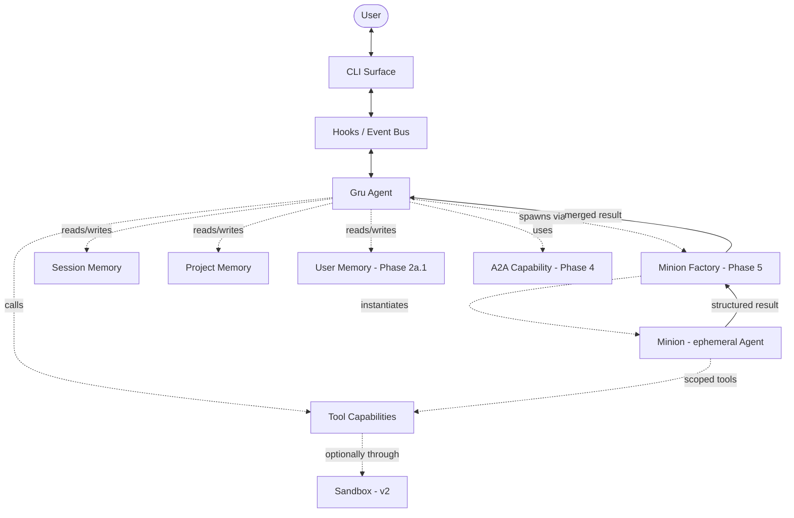
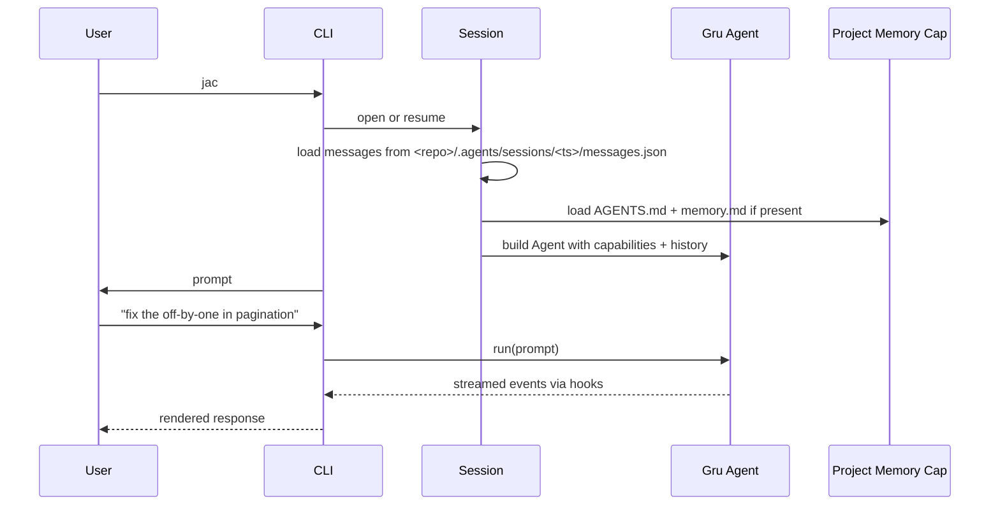
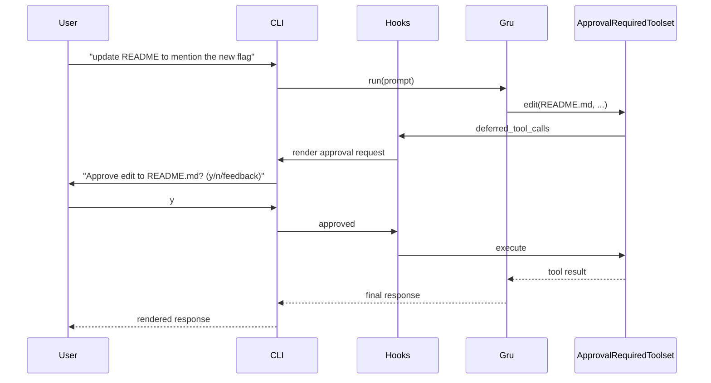

# JAC — Architecture

> **Last revised:** 2026-05-24 · Living design doc. Decisions are locked in §5.
>
> As-built module map: [developer/codebase-map.md](developer/codebase-map.md).
> Memory paths: [user-guide/sessions-and-memory.md](user-guide/sessions-and-memory.md).
> Phase checklist: [progress.md](progress.md).

## 1. System overview

JAC is a thin orchestration layer over Pydantic AI. The model and agent loop are Pydantic AI's. JAC's contribution is: persona (Gru), packaged capabilities, a CLI surface, and tier-aware memory.

**Core idea:** every box that isn't `Gru`, `Minion`, or `CLI` is a **Pydantic AI Capability**. Capabilities are the atom of the system.

## 2. How JAC maps to Pydantic AI

Use these primitives — don't reimplement them.

| JAC concept | Pydantic AI primitive | Notes |
| --- | --- | --- |
| **Gru** | `Agent` (long-lived) | One per session. Model selected by *tier* via active profile (D22), not hardcoded. |
| **Minion** | `Agent` from a skill (`mode: minion`) | Short-lived. Loaded from a community-format `SKILL.md` file (D21). Phase 5. |
| **Skill (inline)** | Markdown + YAML frontmatter | `SkillsCapability` injects body on trigger or `/skill NAME`. Phase 3. |
| **Tool bundles** | Custom `Capability` providing `FunctionToolset` | One capability per concern (fs, shell, search, memory, web, process, clarify, plan). |
| **HITL approval** | `ApprovalRequiredToolset` + `deferred_tool_calls` hook | Built-in. Mark tools `approval_required`; CLI handles prompt. |
| **CLI event bus** | `Hooks` lifecycle events → `asyncio.Queue` | CLI registers `Hooks`, renders from queue. All surfaces reuse same capabilities. |
| **Session memory** | `ModelMessagesTypeAdapter` + disk | Storage is our responsibility; serialization is PAI's. |
| **Project memory** | Custom `Capability` with `get_instructions()` | Auto-injects `<repo>/AGENTS.md` + `<repo>/.agents/memory.md` into system prompt. |
| **History compaction** | `ProcessHistory` capability | Built-in processor function. Token-budget-aware (D20). |
| **Cheap routing** | `pydantic_ai.direct.model_request_sync` | Lightweight model calls without spinning up a full agent loop. |
| **Tracing** | `Instrumentation` capability + Logfire | One-line setup via `setup_observability()`. |
| **A2A inbound** | `fasta2a` wrapped as a `Capability` | Guest Gru on background asyncio task; isolated from host session (D24). |
| **A2A outbound** | Custom toolset: `a2a_discover` + `a2a_call` | Talks to any A2A-compatible agent (D24). |
| **YOLO / Plan Mode** | `ModeCapability` base (v2) | Toolset filter + approval override. Deferred — D23/D29. |

## 3. Tool calls must carry a `reason: str`

**Every tool exposed to Gru or a minion must accept `reason: str` as its first argument.** The LLM justifies each call in one sentence.

**Enforcement** — structural, not prompt-based:
- `@jac_tool` decorator requires the parameter at registration time.
- `jac_function_toolset()` rejects tools missing it at agent construction (fail-fast).
- The `before_tool_execute` hook surfaces the reason in the approval prompt.

This applies to all tools: filesystem, shell, memory writes, search — everything. MCP tools from external servers are exempt (D28) and render as `reason: (mcp tool — no reason captured)`.

## 4. Key data flows

### 4a. Session start → first turn

### 4b. HITL on a sensitive tool

## 5. Decisions made

Locked decisions — do not deviate without updating this table and `docs/progress.md`.

| # | Decision |
| --- | --- |
| D1 | **Minion task packet:** `objective` (req), `success_criteria` (req), `relevant_files` (opt), `forbidden_actions` (opt), `expected_output` (req). Templates may extend with their own fields. |
| D2 | **Approval granularity:** per-tool, with an optional `risk: high` tag for one-off escalation. Every tool call carries a `reason: str` rendered in the approval UI. Approval responses may carry user feedback in-band (D26) so a denied call can redirect the model without a wasted turn. |
| D3 | **Session ID:** timestamp folder — `<repo>/.agents/sessions/2026-05-19T16-23-04/`. Human-readable, sorts chronologically. |
| D4 | **Project memory:** prose `memory.md` first. Add structured `facts.jsonl` only if/when prose retrieval gets noisy. Memory management is a last resort. |
| D5 | **Skills location (Phase 3):** project (`<repo>/.agents/skills/`) and user (`~/.jac/skills/`). Project shadows user on name collision. |
| D6 | **CLI stack:** `typer` (commands) + `rich` (rendering) + `prompt-toolkit` (interactive input loop). |
| D7 | **A2A:** `fasta2a` for server-side; bespoke HTTP client toolset for outbound. Both wrapped as JAC capabilities. **Phase 4 (in flight).** |
| D8 | **Tracing schema:** every Logfire span carries `template`, `task_id`, `parent_run_id`, `token_cost`, `duration`, `exit_status`. |
| D9 | **Config layering:** package defaults → user (`~/.jac/`) → project (`<repo>/.agents/`) → env vars → CLI args. Required values without an override raise `JacConfigError` — never silent defaults. |
| D10 | **File-format standards:** YAML for human-edited structured data; JSON / JSONL for machine state; Markdown for prose; dotenv for secrets. |
| D11 | **Workspace layout:** user workspace at `~/.jac/`, project workspace at `<repo>/.agents/`. Sessions live at project scope only. `AGENTS.md` at repo root (community convention) and `~/.jac/AGENTS.md`; both auto-loaded into instructions. JAC never writes to `AGENTS.md`. |
| D12 | **No hardcoded defaults for required runtime values.** No model default in code; user configures via env, CLI flag, or config file. |
| D13 | **Profiles + secrets:** named profiles in `~/.jac/config.yaml`. Required secret env vars inferred from provider prefix via catalog (D19). Resolution order: process env → configured backend (`keyring` / `dotenv` / `env-only`) → fail-first. Profile activation writes `os.environ`. |
| D14 | **Memory write path (2×2):** `remember(reason, content, category, scope)` writes to `~/.jac/memory.md` (`scope="user"`) or `<repo>/.agents/memory.md` (`scope="project"`). `forget(reason, content, scope)` removes by exact match. `scope` is required; `scope="project"` outside a git repo raises. Audit comment per entry: `<!-- jac: <timestamp> session: <id> -->`. Soft ~25-entry size warning. |
| D15 | **In-session checklist:** `plan(reason, steps)` / `update_plan(reason, step, status)`. State on `PlanCapability` instance — never a module global. No HITL on the checklist itself; it's visible working memory only. Per D27, state persists across `--resume` (in-progress steps flip to pending). Names stay `plan`/`PlanCapability`/`plan.json` until D23 ships in v2. |
| D16 | **Background processes (`ProcessCapability`):** `start_process` / `tail_process` / `kill_process` / `list_processes`. `run_shell` is synchronous (30 s timeout); longer work uses `start_process`. 2000-line ring buffer per process; output not streamed to EventBus. REPL shuts down survivors on exit (SIGTERM → 5 s → SIGKILL). |
| D17 | **Structured user prompts (`clarify`):** `clarify(reason, question, options)` emits a `ClarifyRequest` event with an `asyncio.Future`. Renderer prompts user; resolves with selected index + verbatim text. Not approval-gated. 2–8 options; question ≤500 chars. Per D26, gains a "Type your own answer" free-text option. |
| D18 | **Web tools:** `web_search` + `fetch_url` — read-only, no approval required. SSRF guard on fetch. `max_results` 1–10 (default 5); fetch returns ≤50k chars. **DDG is default; Tavily used when `TAVILY_API_KEY` is set** (Phase 1.7.h). |
| D19 | **Provider catalog (`providers.yaml`):** shipped `src/jac/data/providers.yaml`, deep-merged with `~/.jac/providers.yaml`. Drives credential inference and `jac init` wizard. Unknown prefixes warn; no keys required unless `requires_env` set. |
| D20 | **Token-aware history compaction (supersedes Phase 2b).** Budget: `settings.compaction.max_context_tokens` (default 200k). Ladder: warn at 60%, auto-compact at 70% (summarizes dropping slice using `small` tier), hard-refuse at 85% (user must `/clear`). Original slices preserved under `<session>/compacted/<n>.json`. |
| D21 | **Skills use the Anthropic community format.** Loaded from `~/.jac/skills/<name>/SKILL.md` (user) and `<repo>/.agents/skills/<name>/SKILL.md` (project). YAML frontmatter + markdown body. `mode: inline` injects context; `mode: minion` spawns a sub-agent (Phase 5 runtime). Replaces the old bespoke YAML AgentSpec path. |
| D22 | **Tiered profiles (small / medium / large).** Profile `tiers:` block maps tier names to ordered model lists. `active_tier:` sets Gru's default. Minions select by `model_tier:`, never by model name. `/model TIER` switches tier for session; `/model PROVIDER:ID` ad-hoc override. Pre-D22 `model:` profiles raise on `list_profiles()` — `jac init` auto-migrates. |
| D23 | **Plan Mode — deferred to v2 (2026-05-23).** Structural toolset swap: read-only subset + `write_plan`. Bundled `plan`→`tasks` rename defers with it. Open questions: multi-plan handoff, budget hazard, `ModeCapability` base scope. Design locked; only timing slipped. |
| D24 | **A2A design.** Inbound: single guest Gru per server start, fresh context per request via fasta2a `Storage.load_context()`. Narrowed toolset: `[read_file, list_dir, grep, glob]` — no writes, no shell, no memory writes, no clarify. Auth: ephemeral bearer token, regenerated on restart. Outbound: `a2a_discover` + `a2a_call`. Peer config under profile `a2a.peers.<name>`. Guest token usage feeds `project_total_tokens` (D25). Streaming not supported in v1. Contexts + audit: `<project>/.agents/a2a/`. |
| D25 | **Budgets are token-based, never dollar-based.** Knobs: `budget.session_input_tokens`, `session_total_tokens`, `project_total_tokens`. Warn at 80%, hard-stop at 100%; `/budget extend N` overrides for session. Defaults `null` — opt-in only. |
| D26 | **In-band feedback on deny.** `denied_with_feedback(text)` returns user text as tool result — no wasted turn. `clarify` gains "Type your own answer" option (`free_text=True`). Both reuse existing event-bus `Future` plumbing. |
| D27 | **Plan checklist persists across `--resume`.** Saved to `<session>/plan.json` on every mutation. On resume, `in_progress` steps flip to `pending`. Greeting surfaces restored checklist. |
| D28 | **MCP tools skip `reason: str` enforcement.** External MCP servers don't know our discipline. Render `reason: (mcp tool — no reason captured)` in approval UI. JAC-authored tools exposed as MCP still carry `reason:`. |
| D29 | **YOLO Mode sketch — v2 design only.** `approval_override` returns `"auto-allow"` for mutating tools. Git-Clean Guard required before entry. Validates that `ModeCapability` base needs both `filter_capabilities` (Plan Mode) and `approval_override` (YOLO) knobs. |
| D30 | **A2A module layout.** `capabilities/a2a/` subfolder: `__init__.py` (`A2ACapability`), `server.py`, `guest.py`, `auth.py`, `card.py`, `storage.py`, `audit.py`, `client.py`, `auth_strategies.py`. CLI surface: `cli/slash/a2a.py` (slash handlers) + `cli/a2a.py` (headless typer command). |
| D31 | **Outbound A2A auth is pluggable per peer.** `auth:` block is a discriminated union: `bearer` / `api_key` / `oauth2_client_credentials` (OIDC / GCP deferred to Phase 4.d). `AuthStrategy` Protocol: `async def headers_for() -> dict[str, str]`. Strategy instance cached per peer on `A2ACapability`. Session peers (`/a2a peer add`) are in-memory only — never on disk. The LLM only passes peer names; credentials never cross the agent boundary. |

### Still open

- Default model selection per minion template (Phase 5 grooming will lock this).
- Which tools default to `risk: high` beyond the obvious (shell, delete).
- Approval prompt response format — `y/n/feedback` or fewer options?
