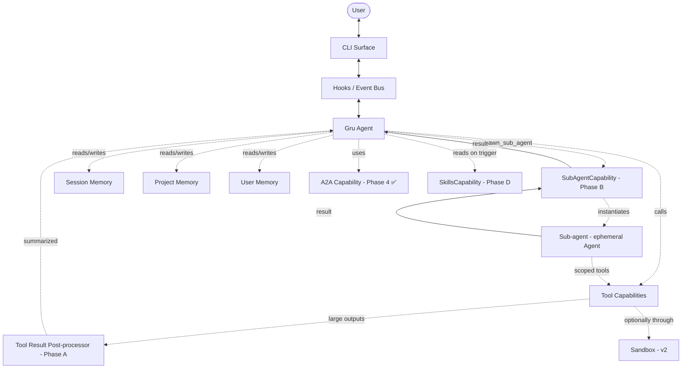
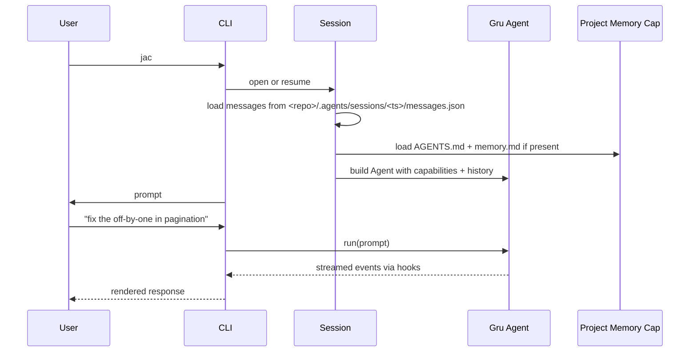
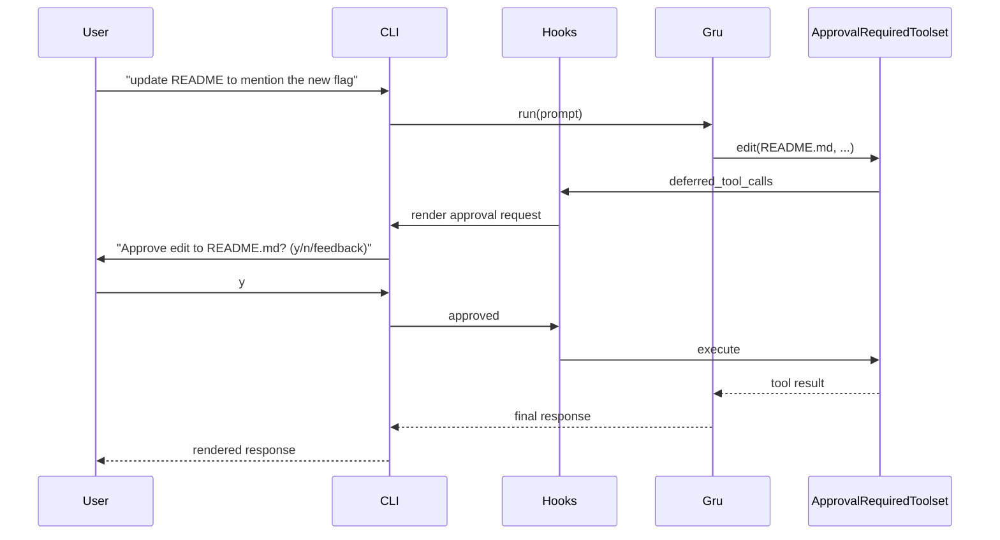
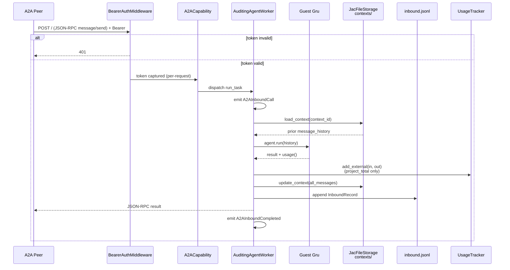
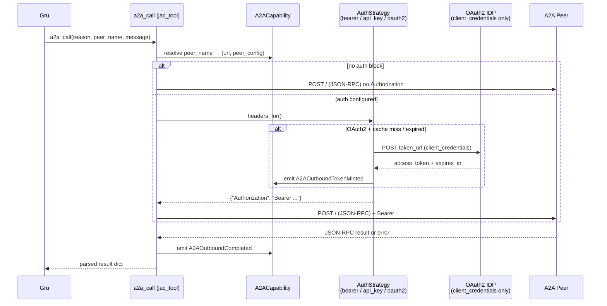

# JAC — Architecture

> **Last revised:** 2026-05-26 · Living design doc. Decisions are locked in §5.
>
> Module strategy (where things go + slash-vs-capability rulebook): [developer/module-strategy.md](developer/module-strategy.md).
> As-built module map: [developer/codebase-map.md](developer/codebase-map.md).
> Memory paths: [user-guide/sessions-and-memory.md](user-guide/sessions-and-memory.md).
> Phase checklist: [progress.md](progress.md).
> Cost-efficiency design (active roadmap driver): [design/cost-efficient-orchestration.md](design/cost-efficient-orchestration.md).

## 0. Product thesis & cost model

**JAC is orchestration around an intelligent layer.** The LLM is the brain; JAC is the nervous system, eyes, hands, and feet. The model only thinks. Everything that determines whether that thinking is cheap and effective — what enters the context, when it enters, which tier model processes it, what work is delegated elsewhere — is JAC's responsibility.

**Cost is the metric we optimize against.** Approximately:

```
cost ≈ Σ over turns of (input_tokens × input_price + output_tokens × output_price)
```

The model's price-per-token is exogenous. JAC controls input_tokens. Every design decision is judged against that.

### Five levers JAC pulls

| Lever | Mechanism | Where in code |
| --- | --- | --- |
| **1. Sub-agents** | Delegate context-heavy work to an isolated `Agent` so its intermediate tokens never reach the main loop. Only the result returns. | Phase B — `spawn_sub_agent` tool + `SubAgentCapability`. |
| **2. Tier-aware model selection** | Profiles map `small` / `medium` / `large` to ordered model lists (D22). Sub-agents take a `tier` arg, never a model name. Main agent stays on its profile tier. | `jac.profiles`, plus Phase B tier-HITL approval. |
| **3. Tool result post-processor** | When a tool returns above a threshold AND a cheap tier is configured, route the raw output through the small model with a summarize prompt before it lands in the agent loop. Original cached to disk. | Phase A — wrapper around `FunctionToolset.call_tool`. |
| **4. Cache-friendly prompt assembly** | Order system prompt → tools → memory → history so the cache breakpoint sits at the stable/changing boundary. Anthropic cache hits cost ~10% of input. | Phase A — `Gru.build_instructions()` review. |
| ~~5. Deterministic hooks~~ | Dropped — `success_criteria` in the task packet plus a post-return `run_shell` call from the main agent covers the use case without framework machinery. | — |

### Anti-patterns we structurally refuse

- Letting the main agent's context grow turn-by-turn with tool results it doesn't need to reason over (→ Lever 3).
- Adding "another agent type" or "another runtime mode" when the answer is one more tool the existing agent calls (→ Lever 1: one tool, many uses).
- Optimizing model choice while leaving raw 200KB tool outputs unfiltered (→ Lever 3 before tier-tuning).
- Inventing bespoke skill formats when the community Anthropic format already covers it (→ Phase D follows the spec).

### Where each lever lives on the roadmap

Phase A (foundation, shipped v0.3.0) handles levers 3 and 4 — pure plumbing, biggest immediate cost win. Phase B (shipped v0.3.0) introduces lever 1 (sub-agents). Phase D (shipped v0.4.0) adds the skill loader. Lever 2 (tier-aware) is partially shipped via D22 and extended in Phase B with the HITL-approved tier on spawn. Lever 5 (deterministic hooks) was considered and dropped — see D37. Phase ordering after the 2026-05-27 external review: **F=MCP loader, G=Plan Mode (D23), H=A2A 4.e + broader tests**. Sandboxing for v2 uses `pydantic-monty` directly (D43). Evaluation via Logfire span replay is a Phase 7 stream (D44). Editor surface for v2 uses ACP (D45, condition-gated). See [`design/cost-efficient-orchestration.md`](design/cost-efficient-orchestration.md) for the full Phase A-H design and [`progress-roadmap.md`](progress-roadmap.md) for Harness reuse-vs-build decisions and the full ACP design.

## 1. System overview

JAC is a thin orchestration layer over Pydantic AI. The model and agent loop are Pydantic AI's. JAC's contribution is: persona (Gru), packaged capabilities, a CLI surface, tiered memory, and cost-efficient delegation (sub-agents + tool-result summarization).



**Core idea:** every box that isn't `Gru`, `Sub-agent`, or `CLI` is a **Pydantic AI Capability**. Capabilities are the atom of the system.

## 2. How JAC maps to Pydantic AI

Use these primitives — don't reimplement them.

| JAC concept | Pydantic AI primitive | Notes |
| --- | --- | --- |
| **Gru** | `Agent` (long-lived) | One per session. Model selected by *tier* via active profile (D22), not hardcoded. |
| **Sub-agent** | `Agent` built fresh per spawn (Phase B) | Short-lived. Built by `SubAgentCapability` from a task packet (D36). Tier comes from the spawn args (D39). Depth cap = 1 — sub-agents cannot spawn further sub-agents (D40). |
| **Skill** | Markdown + YAML frontmatter (community Anthropic format) | `SkillsCapability` (Phase D) injects body on trigger or `/skill NAME`. **No `mode: minion`** — skills are loadable prompts, not a runtime mode (D21 revised). |
| **Tool bundles** | Custom `Capability` providing `FunctionToolset` | One capability per concern (fs, shell, search, memory, web, process, clarify, plan). |
| **Tool result post-processor** | Wrapper around `FunctionToolset.call_tool` | Above threshold + cheap tier available → routes through `direct.model_request_sync` to summarize (D38). Phase A. |
| **HITL approval** | `ApprovalRequiredToolset` + `deferred_tool_calls` hook | Built-in. Mark tools `approval_required`; CLI handles prompt. Sub-agent spawns are HITL-gated and surface task summary + tier (D39). |
| **CLI event bus** | `Hooks` lifecycle events → `asyncio.Queue` | CLI registers `Hooks`, renders from queue. All surfaces reuse same capabilities. |
| **Session memory** | `ModelMessagesTypeAdapter` + disk | Storage is our responsibility; serialization is PAI's. |
| **Project memory** | Custom `Capability` with `get_instructions()` | Auto-injects `<repo>/AGENTS.md` + `<repo>/.agents/memory.md` into system prompt. |
| **History compaction** | `ProcessHistory` capability | Built-in processor function. Token-budget-aware (D20). |
| **Cheap routing** | `pydantic_ai.direct.model_request_sync` | Lightweight model calls without spinning up a full agent loop. Powers the tool result post-processor (D38). |
| **Tracing** | `Instrumentation` capability + Logfire | One-line setup via `setup_observability()`. Sub-agent spans nest under parent via `parent_run_id` (D8). |
| **A2A inbound** | `fasta2a` wrapped as a `Capability` | Guest Gru on background asyncio task; isolated from host session (D24). |
| **A2A outbound** | Custom toolset: `a2a_discover` + `a2a_call` | Talks to any A2A-compatible agent (D24). |
| **YOLO / Plan Mode** | `ModeCapability` base | Toolset filter + approval override. Plan Mode pulled forward to Phase G (was F, demoted behind MCP 2026-05-27); YOLO still v2 with `pydantic-monty` sandboxing (D43). (D23/D29/D43) |

## 3. Tool calls must carry a `reason: str`

**Every tool exposed to Gru or a sub-agent must accept `reason: str` as its first argument.** The LLM justifies each call in one sentence.

**Enforcement** — structural, not prompt-based:
- `@jac_tool` decorator requires the parameter at registration time.
- `jac_function_toolset()` rejects tools missing it at agent construction (fail-fast).
- The `before_tool_execute` hook surfaces the reason in the approval prompt.

This applies to all tools: filesystem, shell, memory writes, search — everything. MCP tools from external servers are exempt (D28) and render as `reason: (mcp tool — no reason captured)`.

## 4. Key data flows

### 4a. Session start → first turn



### 4b. HITL on a sensitive tool



## 5. Decisions made

Locked decisions — do not deviate without updating this table and `docs/progress.md`.

| # | Decision |
| --- | --- |
| D1 | **Sub-agent task packet** (revised 2026-05-26, was "Minion task packet"): `objective` (req), `success_criteria` (req), `relevant_files` (opt), `forbidden_actions` (opt), `expected_output` (req). See D36 for the active Phase B Pydantic model. |
| D2 | **Approval granularity:** per-tool, with an optional `risk: high` tag for one-off escalation. Every tool call carries a `reason: str` rendered in the approval UI. Approval responses may carry user feedback in-band (D26) so a denied call can redirect the model without a wasted turn. |
| D3 | **Session ID:** timestamp folder — `<repo>/.agents/sessions/2026-05-19T16-23-04/`. Human-readable, sorts chronologically. |
| D4 | **Project memory:** prose `memory.md` first. Add structured `facts.jsonl` only if/when prose retrieval gets noisy. Memory management is a last resort. |
| D5 | **Skills location (Phase 3):** project (`<repo>/.agents/skills/`) and user (`~/.jac/skills/`). Project shadows user on name collision. |
| D6 | **CLI stack:** `typer` (commands) + `rich` (rendering) + `prompt-toolkit` (interactive input loop). |
| D7 | **A2A:** `fasta2a` for server-side; bespoke HTTP client toolset for outbound. Both wrapped as JAC capabilities. **Phase 4 (in flight).** |
| D8 | **Tracing schema:** every Logfire span carries `template`, `task_id`, `parent_run_id`, `token_cost`, `duration`, `exit_status`. |
| D9 | **Config layering:** package defaults → user (`~/.jac/`) → project (`<repo>/.agents/`) → env vars → CLI args. Required values without an override raise `JacConfigError` — never silent defaults. |
| D10 | **File-format standards:** YAML for human-edited structured data; JSON / JSONL for machine state; Markdown for prose; dotenv for secrets. |
| D11 | **Workspace layout:** user workspace at `~/.jac/`, project workspace at `<repo>/.agents/`. Sessions live at project scope only. `AGENTS.md` at repo root (community convention) and `~/.jac/AGENTS.md`; both auto-loaded into instructions. JAC never writes to `AGENTS.md`. |
| D12 | **No hardcoded defaults for required runtime values.** No model default in code; user configures via env, CLI flag, or config file. |
| D13 | **Profiles + secrets:** named profiles in `~/.jac/config.yaml`. Required secret env vars inferred from provider prefix via catalog (D19). Resolution order: process env → configured backend (`keyring` / `dotenv` / `env-only`) → fail-first. Profile activation writes `os.environ`. |
| D14 | **Memory write path (2×2):** `remember(reason, content, category, scope)` writes to `~/.jac/memory.md` (`scope="user"`) or `<repo>/.agents/memory.md` (`scope="project"`). `forget(reason, content, scope)` removes by exact match. `scope` is required; `scope="project"` outside a git repo raises. Audit comment per entry: `<!-- jac: <timestamp> session: <id> -->`. Soft ~25-entry size warning. |
| D15 | **In-session checklist:** `plan(reason, steps)` / `update_plan(reason, step, status)`. State on `PlanCapability` instance — never a module global. No HITL on the checklist itself; it's visible working memory only. Per D27, state persists across `--resume` (in-progress steps flip to pending). Names stay `plan`/`PlanCapability`/`plan.json` until D23 ships in v2. |
| D16 | **Background processes (`ProcessCapability`):** `start_process` / `tail_process` / `kill_process` / `list_processes`. `run_shell` is synchronous (30 s timeout); longer work uses `start_process`. 2000-line ring buffer per process; output not streamed to EventBus. REPL shuts down survivors on exit (SIGTERM → 5 s → SIGKILL). |
| D17 | **Structured user prompts (`clarify`):** `clarify(reason, question, options)` emits a `ClarifyRequest` event with an `asyncio.Future`. Renderer prompts user; resolves with selected index + verbatim text. Not approval-gated. 2–8 options; question ≤500 chars. Per D26, gains a "Type your own answer" free-text option. |
| D18 | **Web tools:** `web_search` + `fetch_url` — read-only, no approval required. SSRF guard on fetch. `max_results` 1–10 (default 5); fetch returns ≤50k chars. **DDG is default; Tavily used when `TAVILY_API_KEY` is set** (Phase 1.7.h). |
| D19 | **Provider catalog (`providers.yaml`):** shipped `src/jac/data/providers.yaml`, deep-merged with `~/.jac/providers.yaml`. Drives credential inference and `jac init` wizard. Unknown prefixes warn; no keys required unless `requires_env` set. |
| D20 | **Token-aware history compaction (supersedes Phase 2b).** Budget: `settings.compaction.max_context_tokens` (default 200k). Ladder: warn at 60%, auto-compact at 70% (summarizes dropping slice using `small` tier), hard-refuse at 85% (user must `/clear`). Original slices preserved under `<session>/compacted/<n>.json`. |
| D21 | **Skills use the Anthropic community format** (revised 2026-05-26). Loaded from `~/.jac/skills/<name>/SKILL.md` (user) and `<repo>/.agents/skills/<name>/SKILL.md` (project). YAML frontmatter + markdown body. **Skills are loadable prompts / playbooks** — read into Gru's context on description-based trigger or via `/skill use NAME`. The previously-proposed `mode: minion` is dropped; sub-agents come from the `spawn_sub_agent` tool (D35), not from skills. A skill may *recommend* spawning a sub-agent in its prose, but the runtime mechanism is the tool, not a frontmatter field. |
| D22 | **Tiered profiles (small / medium / large).** Profile `tiers:` block maps tier names to ordered model lists. `active_tier:` sets Gru's default. Minions select by `model_tier:`, never by model name. `/model TIER` switches tier for session; `/model PROVIDER:ID` ad-hoc override. Pre-D22 `model:` profiles raise on `list_profiles()` — `jac init` auto-migrates. |
| D23 | **Plan Mode — pulled forward from v2; now Phase G (2026-05-27 reorder, was Phase F).** Structural toolset swap: read-only subset + `write_plan`. Valuable because the main agent benefits from planning *before* spawning sub-agents. Bundled `plan`→`tasks` rename moves with it. `ModeCapability` base built alongside Plan Mode so YOLO (still v2) slots in later. Demoted behind MCP loader after external review noted MCP delivers more daily-workflow value sooner. |
| D24 | **A2A design.** Inbound: single guest Gru per server start, fresh context per request via fasta2a `Storage.load_context()`. Narrowed toolset: `[read_file, list_dir, grep, glob]` — no writes, no shell, no memory writes, no clarify. Auth: ephemeral bearer token, regenerated on restart. Outbound: `a2a_discover` + `a2a_call`. Peer config under profile `a2a.peers.<name>`. Guest token usage feeds `project_total_tokens` (D25). Streaming not supported in v1. Contexts + audit: `<project>/.agents/a2a/`. |
| D25 | **Budgets are token-based, never dollar-based.** Knobs: `budget.session_input_tokens`, `session_total_tokens`, `project_total_tokens`. Warn at 80%, hard-stop at 100%; `/budget extend N` overrides for session. Defaults `null` — opt-in only. |
| D26 | **In-band feedback on deny.** `denied_with_feedback(text)` returns user text as tool result — no wasted turn. `clarify` gains "Type your own answer" option (`free_text=True`). Both reuse existing event-bus `Future` plumbing. |
| D27 | **Plan checklist persists across `--resume`.** Saved to `<session>/plan.json` on every mutation. On resume, `in_progress` steps flip to `pending`. Greeting surfaces restored checklist. |
| D28 | **MCP tools skip `reason: str` enforcement.** External MCP servers don't know our discipline. Render `reason: (mcp tool — no reason captured)` in approval UI. JAC-authored tools exposed as MCP still carry `reason:`. |
| D29 | **YOLO Mode sketch — v2 design only.** `approval_override` returns `"auto-allow"` for mutating tools. Git-Clean Guard required before entry. Validates that `ModeCapability` base needs both `filter_capabilities` (Plan Mode) and `approval_override` (YOLO) knobs. |
| D30 | **A2A module layout.** `capabilities/a2a/` subfolder: `__init__.py` (`A2ACapability`), `server.py`, `guest.py`, `auth.py`, `card.py`, `storage.py`, `audit.py`, `client.py`, `auth_strategies.py`. CLI surface: `cli/slash/a2a.py` (slash handlers) + `cli/a2a.py` (headless typer command). |
| D31 | **Outbound A2A auth is pluggable per peer.** `auth:` block is a discriminated union: `bearer` / `api_key` / `oauth2_client_credentials` (OIDC / GCP deferred to Phase 4.e). `AuthStrategy` Protocol: `async def headers_for() -> dict[str, str]`. Strategy instance cached per peer on `A2ACapability`. Session peers (`/a2a peer add`) are in-memory only — never on disk. The LLM only passes peer names; credentials never cross the agent boundary. |
| D32 | **A2A `a2a_call` blocks until terminal.** fasta2a's `message/send` returns `submitted` immediately while the broker runs the work asynchronously. JAC's client transparently polls `tasks/get` (250 ms → 2 s backoff, 120 s total) until the task reaches a terminal state (`completed` / `failed` / `canceled` / `rejected`) or a client-action state (`input-required` / `auth-required`). On timeout the returned dict carries `_jac_timeout: true`. The model never manages task ids or polling. **URL → peer auto-promote:** a raw URL passed to `a2a_call` that exactly matches one configured peer's URL is promoted to that peer (auth applied). Zero or multi-match falls through to raw call. |
| D33 | **A2A file transfer is inline-bytes only in v1.** Both directions use `FileWithBytes`; `FileWithUri` is deferred (no SSRF guard yet). Outbound `a2a_call(files=[paths])` reads, base64-encodes (5 MB cap per file), attaches as `FilePart`. Filename in both `file.name` (spec) and `metadata.filename` (belt-and-braces — fasta2a's TypedDict drops `file.name`). On receive, the client decodes `FilePart` bytes in `artifacts[]` and `history[]` to `<project>/.agents/a2a/inbound-files/<task_id>/<sanitized>` and surfaces paths as `_jac_saved_files`; bytes never enter the LLM context. **Inbound (server-side):** `AuditingAgentWorker` materializes file parts to `<project>/.agents/a2a/guest-uploads/<context_id>/<sanitized>` (per-context for multi-turn reuse) AND leaves the original `FilePart` intact so multimodal models still see bytes via fasta2a's existing `BinaryContent` path. A synthetic `[a2a attachment]` `UserPromptPart` tells the agent where files landed. Filename sanitization defeats `..` traversal; collisions get numeric suffixes. |
| D34 | **Cost-efficiency is the product thesis** (2026-05-26 reframe). JAC is orchestration around an intelligent layer. Cost ≈ Σ(`turn_tokens × turn_price`). Every architectural decision is judged against this. Four active levers: sub-agents (D35), tier-aware selection (D22 + D39), tool result post-processor (D38), cache-friendly prompt assembly (Phase A). Deterministic hooks (D37) were considered and dropped — see D37. See §0 and `design/cost-efficient-orchestration.md`. |
| D35 | **`spawn_sub_agent` / `spawn_sub_agents` are the delegation primitives.** Sequential spawn: `spawn_sub_agent(reason, task_summary, tier, task_packet)`. Parallel fan-out: `spawn_sub_agents(reason, spawns)` — shipped Phase E. No bespoke runtime modes, no separate factory tools. Skills (D21) may *recommend* spawning a sub-agent in their prose; the tools are the runtime. Sub-agents are isolated `Agent` instances with their own context. |
| D36 | **Task packet schema.** `SubAgentTaskPacket` Pydantic model (Phase B): `objective: str` (req), `success_criteria: list[str]` (opt), `relevant_paths: list[str]` (opt), `forbidden_actions: list[str]` (opt), `expected_output: str` (opt — free-text spec), `allowed_tools: list[str] \| None` (opt — field accepted by the model; **filtering is deferred to a follow-up** — values are passed through but not yet enforced at agent construction), `max_turns: int = 10`. Supersedes D1 fields list. |
| D37 | **Post-flight hooks — considered and dropped.** Hook machinery (Python/shell callables attached per-spawn, retry budget 3, failure re-routed into sub-agent) was designed but not built. Verdict: complexity doesn't earn its keep. JAC runs in any environment so baked-in hooks are wrong; on-the-fly verification is equivalent to putting verification steps in `success_criteria` and having the main agent call `run_shell` after sub-agent return. No `hooks` field on the packet, no `HookSpec` / `HookResult` models, no `hooks_exhausted` exit status. |
| D38 | **Tool result post-processor with cheap-tier summarization.** When any tool's stringified result exceeds the threshold AND the active profile has a `small` tier strictly cheaper-per-output-token than the current agent's tier, route the result through `pydantic_ai.direct.model_request_sync` against the `small` tier with a fixed summarize prompt. Summarized result returns to the agent loop tagged: `[AI-summarized via <model>: original NNN tokens — full output at <path>]`. **Original is saved** to `<project>/.agents/cache/tool-results/<run-id>/<call-id>.txt` for re-read. **Defaults:** threshold = 8000 tokens (configurable per profile under `cost.tool_result_threshold_tokens`); opt-out per-tool-name via `cost.no_summarize_tools: [name, ...]`. Applies to main agent *and* sub-agents. |
| D39 | **Sub-agent spawn is HITL-gated; tier (never model) is approved.** `spawn_sub_agent` is approval-required. The HITL prompt surfaces: `reason`, `task_summary`, `tier ∈ {small, medium, large}`. User can Approve, Deny, or counter-propose a different tier. Selected tier resolves against the active profile's tier mapping; if missing, cascade up (small → medium → large) with a note in the approval line. **The main agent never picks a specific model name.** |
| D40 | **Sub-agent depth cap = 1 in v1.** Sub-agents inherit the main agent's toolset minus `spawn_sub_agent` — enforced structurally at agent construction (the tool literally isn't in the toolset), not via prompt. Configurable cap reconsidered only after real demand emerges. Logfire `parent_run_id` chain still works; nested span depth is bounded. |
| D41 | **Bidirectional sub-agent ↔ main-agent comms — specced, ship cautiously.** Sub-agents get an `ask_main_agent(reason, question, context)` tool (carries `reason: str` per D2 — internal but consistent). **Semantics:** the question is delivered as the `spawn_sub_agent` tool's *intermediate yield* (return value with `_intermediate: true`); main agent processes it as a normal tool result, replies via a sibling `respond_to_sub_agent(answer)` tool call, sub-agent unblocks and continues. **Caps:** max 5 round-trips per spawn (anti-thrashing). **Risks acknowledged:** confusing transcript UX, doubled per-question turn cost, HITL multiplexing — renderer needs explicit `[sub-agent → main]` / `[main → sub-agent]` markers. v1 implementation gated behind a feature flag; default off until UX is validated. |
| D42 | **Tier-HITL counter-proposal flow.** When user denies a `spawn_sub_agent` approval with a tier counter-proposal (`change tier: large`), the deny mechanism reuses D26's in-band feedback — the deny resolves the approval `Future` with a `denied_with_feedback("retry tier=large")` result, the main agent's next turn sees this as the tool result, retries the spawn with the suggested tier. No wasted user input. |
| D43 | **Sandboxing isolation = direct `pydantic-monty` (v2).** Locked 2026-05-27 after evaluating alternatives. **Adopted:** `pydantic_monty.Monty` — Rust-written minimal Python interpreter; microsecond cold start; zero-grant default (no fs / net / env access until external functions are explicitly registered); memory + recursion + time limits. **Rejected:** (a) Docker — network call + cold-start seconds + external dependency, breaks JAC's "runs anywhere" property; (b) `sandbox-exec` (macOS) / `bwrap` (Linux) — OS-specific, leaks host platform details, harder to test; (c) `pydantic-ai-harness`'s `CodeExecutionToolset` — wraps Monty but forces a "write code instead of call tools" execution model that conflicts with JAC's per-tool HITL UX. Implementation sketch: thin `MontyShellCapability` (analogous to existing capability shape) that opt-in routes specific risky tools (initially `run_shell`, later mutating filesystem tools) through `pydantic_monty.Monty` with our toolset registered as external functions. Git-Clean Guard required before YOLO entry (D29). Uses `ModeCapability`'s `approval_override` knob from Phase G (D23). See [`progress-roadmap.md`](progress-roadmap.md) Harness-alignment section for the full reuse-vs-build rationale. |
| D44 | **Evaluation via Logfire span replay — Phase 7 stream (2026-05-27).** Every span already carries D8's schema; that's enough to assert *what the agent did* (not just *what it returned*). Mechanism: `tests/eval/` directory, `just eval` recipe distinct from `just check`, Logfire testing capture for span extraction. First trajectory targets: approval flow correctness, compaction trigger threshold, summarization savings, memory write audit, sub-agent delegation (tier + parent chain + depth cap), skill body injection. Not a new phase number — ongoing quality stream. Builds on existing observability rather than introducing a parallel test harness. Full list in [`progress-roadmap.md`](progress-roadmap.md). |
| D45 | **Editor surface = ACP (Agent Client Protocol), v2, condition-gated (2026-05-27).** [ACP](https://agentclientprotocol.com) is the LSP analogue for coding agents — one spec, any compliant editor. JAC implements the **server side** as `ACPCapability` (same pattern as `A2ACapability`); editor extensions (VS Code, Zed, JetBrains) are generic ACP clients, not JAC-specific. Wire: JSON-RPC stdio (local, stable) + HTTP/WebSocket (remote, WIP). Python SDK exists. Maintained by Sergey Ignatov (JetBrains) under RFD governance. **Why ACP and not alternatives:** bespoke extensions → one per editor, breaks scaling; MCP → wrong shape (tool-centric, no sessions/turns/HITL); A2A → agent-to-agent, not editor-to-agent. **Protocol triangle:** MCP (tools → JAC, Phase F), A2A (JAC ↔ agents, Phase 4), ACP (editor → JAC, v2) — three non-overlapping protocols covering the full integration surface. **Concept mappings (key ones):** ACP sessions ↔ D3 session filesystem; ACP tool-call events ↔ D2 HITL approval queue; ACP slash commands ↔ JAC slash-command handlers; ACP diffs ↔ file-edit output; ACP terminals ↔ `ProcessCapability`. **Ship conditions (both required):** (1) ACP remote HTTP/WebSocket transport stabilises upstream; (2) at least one major editor (VS Code, Zed, or JetBrains) ships an ACP client. Full design, protocol triangle diagram, concept mapping table, and concerns in [`progress-roadmap.md`](progress-roadmap.md) "ACP — Editor surface" section. |

### Still open

- **Sub-agent file system semantics** (Phase B grooming sub-item): same CWD as main agent? Read-only by default? Per-spawn workdir? Current lean: same toolset → same filesystem view, HITL gates writes per-tool the same way the main agent's do.
- **Logfire UX for nested traces**: depth-1 cap (D40) bounds the chain, but renderer affordances for inline sub-agent transcripts are TBD.
- Which tools default to `risk: high` beyond the obvious (shell, delete).
- Approval prompt response format — `y/n/feedback` or fewer options?

## 6. A2A inbound flow

Peers reach our guest Gru via the JSON-RPC server scaffolded by `fasta2a`. Authentication, audit, and budget accounting are JAC's responsibilities; the wire protocol is fasta2a's. Locked in D24 and D30; budget integration added in Phase 4.d.



Side notes:

- The guest's toolset is narrowed to `[read_file, list_dir, grep, glob]` (D24) — no writes, no shell, no memory, no clarify. `FilesystemCapability` bundles writes but the guest never installs an approval handler, so the write tools are unreachable.
- Storage lives under `<project>/.agents/a2a/contexts/<context_id>.json`; the audit log at `<project>/.agents/a2a/inbound.jsonl` is append-only.
- A retention loop runs every hour while the server is up, pruning context files older than `a2a.context_retention_days` (default 3). The audit log is not rotated by us — the operator owns long-term ledger retention.
- `A2AInboundCall` / `A2AInboundCompleted` events post to the host's event bus → the host renderer paints `[a2a in ←]` / `[a2a in ✓]` notifications.
- Guest token usage feeds `UsageTracker.add_external(in, out)`, which counts toward `project_total` but **not** `session_total` (D24 + D25). `/tokens` shows a dedicated "a2a guest" line.

## 8. A2A outbound flow

Gru calls peers via two tools — `a2a_discover` (peek at the AgentCard) and `a2a_call` (actually send a message). Peer credentials never enter the model's context: the LLM passes a peer name, the capability resolves it to a config, the auth strategy mints headers. Locked in D24 and D31.



Auth strategy choices (D31):

| `auth.type` | Static? | I/O | When to use |
| --- | --- | --- | --- |
| `bearer` | yes | none | JAC↔JAC pre-shared static tokens, simple PSK setups |
| `api_key` | yes | none | API key in a custom header (`X-API-Key`, etc.) |
| `oauth2_client_credentials` | no — refreshes lazily | POST to token endpoint | Azure Entra, OIDC providers supporting client_credentials |
| `oidc` (Phase 4.e) | no | discovery + token endpoint | Any IDP advertising `.well-known/openid-configuration` |
| `gcp_id_token` (Phase 4.e) | no | metadata service / service account | Cloud Run, App Engine, GKE workloads |

Privacy guarantees baked into the design:

- **Credentials never enter the LLM context.** `a2a_call` accepts `peer_or_url` and `message`, not a token. The model only sees peer names.
- **Session peers stay in memory.** `/a2a peer add` registers a peer for the running session only — never written to disk. The profile YAML is for stable peers; one-off testing uses the slash command + `getpass`.
- **Token cache is per-peer.** Two peers behind the same IDP get independent strategy instances so an audit can correlate token mints to specific peer configs.
