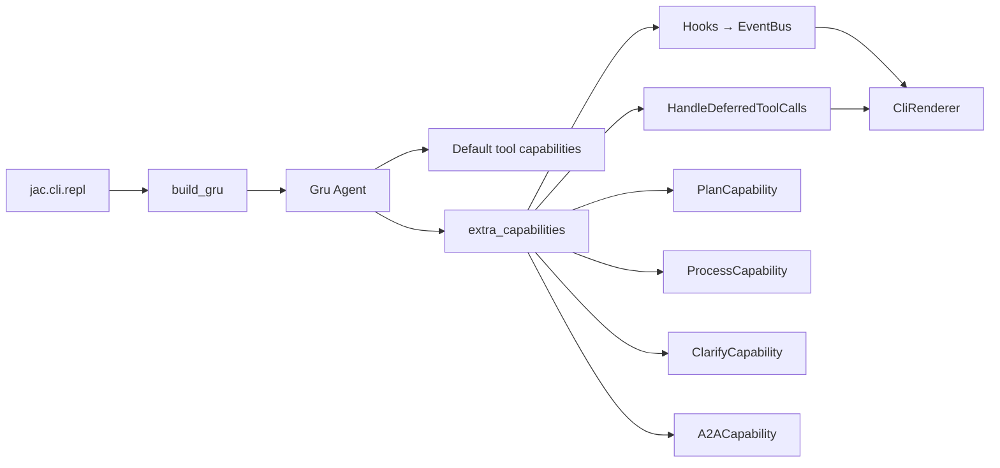

# Capabilities & hooks

> **Audience:** contributors adding tools, subsystems, or UI events.

Almost every cross-cutting concern in JAC is a **Pydantic AI `Capability`**, not a hand-rolled service class. The CLI, headless A2A server, and future surfaces differ only in which capabilities they attach and how they render the event bus.

## Mental model



- **`build_gru`** (`jac.runtime.gru`) composes instructions from `gru_system.md` + session context, then attaches capabilities.
- **Default tools** — filesystem, search, shell, memory, web, token-aware history, dynamic context (`ContextCapability`), Logfire (`Instrumentation`) via `_default_tool_capabilities`.
- **REPL extras** — hooks, approval, plan, process, clarify, A2A (`jac.cli.repl`).

Set `include_default_tools=False` for tests or minimal agents.

## Gru capability stack (interactive REPL)

| Capability | Module | Tools / behavior |
| --- | --- | --- |
| `FilesystemCapability` | `capabilities/filesystem.py` | `read_file`, `write_file`, `edit_file`, `list_dir` — writes approval-gated |
| `SearchCapability` | `capabilities/search.py` | `grep`, `glob` |
| `ShellCapability` | `capabilities/shell.py` | `run_shell` — always approval-gated |
| `MemoryCapability` | `capabilities/memory.py` | `remember`, `forget` — approval-gated |
| `WebCapability` | `capabilities/web.py` | `web_search` (Tavily if key set, else DuckDuckGo), `fetch_url` |
| `ContextCapability` | `capabilities/context.py` | Dynamic `get_instructions()` — AGENTS.md + memory.md re-read each turn |
| `ProcessHistory` (via `make_history_capability`) | `capabilities/history.py` | Token-aware compaction (D20); emits warn/compact/refuse events |
| `Instrumentation` | PAI built-in | Logfire tracing on every Gru run (wired in `runtime/gru.py`) |
| `Hooks` | `runtime/hooks.py` | Pushes lifecycle events to `EventBus` |
| `HandleDeferredToolCalls` | `runtime/approval.py` | Turns deferred tools into approval prompts |
| `PlanCapability` | `capabilities/plan.py` | `plan`, `update_plan`, `get_plan` — persists to `<session>/plan.json` |
| `ProcessCapability` | `capabilities/process.py` | Background processes — `start_process` / `kill_process` approval-gated |
| `ClarifyCapability` | `capabilities/clarify.py` | `clarify` — numbered user picker via bus |
| `A2ACapability` | `capabilities/a2a/` | Server lifecycle + `a2a_discover`, `a2a_call` |

Guest Gru (inbound A2A) is a **separate** `Agent` built by `build_guest_gru` — read-only fs/search only, no bus, no approval, no plan/process/clarify/memory writes. See [A2A operator guide](../user-guide/a2a-operator.md).

## Human-in-the-loop (HITL)

Risky tools are wrapped with `toolset.approval_required(predicate)`:

- Filesystem: `write_file`, `edit_file`
- Shell: `run_shell` (always)
- Memory: `remember`, `forget`
- Process: `start_process`, `kill_process`

The REPL installs `make_approval_handler(bus)`. On a deferred call:

1. Hook emits `ApprovalRequest` with a future.
2. `CliRenderer` shows tool name, **reason**, and args; user answers `y` / `n` / `r` (redirect with feedback).
3. Future resolves; Pydantic AI continues or denies the tool.

Do not implement a parallel approval system.

**Clarify** is intentionally *not* approval-gated — the tool *is* the user question.

## The `reason:` discipline

Every tool exposed to Gru must be decorated with `@jac_tool` (`jac.tools.decorator`). The first parameter after optional `ctx` must be `reason: str`. Validation runs at import/decorate time.

Use `jac_function_toolset(...)` (`jac.tools.toolset`) so non-`@jac_tool` functions cannot slip into a JAC toolset.

## Hooks and the event bus

`make_hooks(bus)` (`jac.runtime.hooks`) subscribes to Pydantic AI hook points and emits typed events onto `jac.runtime.events.EventBus`.

The REPL runs:

1. `agent_task = create_task(gru.run(...))`
2. `await renderer.consume(bus)` until `RunCompleted` / `RunFailed`
3. `await agent_task` for final message history

New UI-facing behavior should add an event dataclass and handle it in `CliRenderer`, not print from inside tools.

## Adding a new tool

1. **Pick the capability** — extend an existing module or add `capabilities/your_feature.py` with a `@dataclass` capability implementing `get_toolset()`.
2. **Define tools** with `@jac_tool` and `reason: str` first.
3. **Register** in `_default_tool_capabilities` if every interactive session should have it, or pass via `extra_capabilities` from the REPL only.
4. **HITL** — if the tool mutates disk, spends money, or spawns processes, use `approval_required`.
5. **Bus** — if the UI should show progress, emit events from the capability (see `ProcessCapability`, `PlanCapability`).
6. **Docs** — update [CLI reference](../user-guide/cli-reference.md) and [drift matrix](../design/audit/drift-matrix.md).
7. **Tests** — add pytest under `tests/` with `TestModel` or mocked bus.

Minimal pattern:

```python
from dataclasses import dataclass
from typing import Any
from pydantic_ai.capabilities import AbstractCapability
from jac.tools import jac_function_toolset, jac_tool

@jac_tool
def my_tool(reason: str, arg: str) -> str:
    """…"""
    return f"done: {arg}"

@dataclass
class MyCapability(AbstractCapability[Any]):
    def get_toolset(self) -> Any:
        return jac_function_toolset(my_tool)
```

Wire in `repl.py` via `extra_capabilities=[..., MyCapability()]` or `build_gru`'s default list.

## Adding a slash command

1. Create `jac/cli/slash/handlers/your_cmd.py`.
2. Use `@register("name", summary="…", usage="/name …")`.
3. Import the module from `jac/cli/slash/__init__.py` so registration runs at startup.
4. Return a `SlashResult` subtype (`Handled`, `RebuildGru`, `SwitchSession`, `StartA2AServer`, …) — the REPL dispatches async side effects.
5. Document in [CLI reference](../user-guide/cli-reference.md).

Slash input is **never** sent to the model — unknown commands raise `UnknownSlashCommand`.

## What not to build here

- Custom minion factory (Phase 5 / skills `mode: minion`)
- Plan Mode toolset swap (v2 / D23)
- MCP loader (Phase 6)
- CodeMode / Monty sandbox (v2)

If a task needs those, stop and check [`progress.md`](../progress.md) first.
