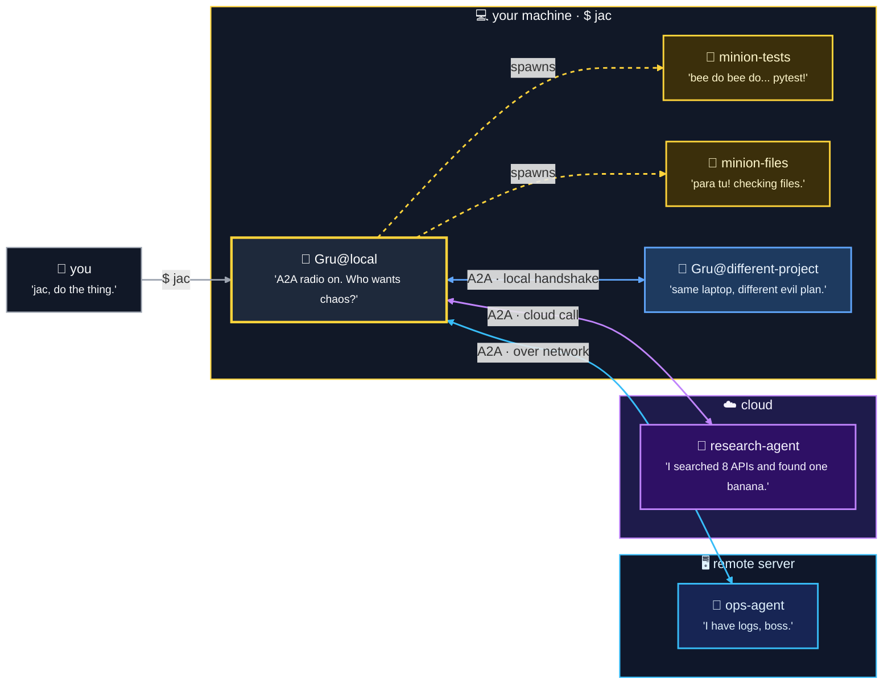

# JAC

> **Just Another Companion/CLI — a local-first agentic coding harness with A2A superpowers.**

JAC is a Python CLI that gives you a local coding companion with tools, memory,
sessions, skills, human approval gates, and Agent-to-Agent communication.

It runs on your machine — your keys, your files, your context.

## What is JAC?

-   :lucide-terminal: **Local-first CLI**

    Start a session, ask for changes, inspect tool calls, approve actions, and keep control. No SaaS overhead. No surprise bills. No mysterious 3am tool calls you didn't approve.

-   :lucide-brain: **Memory + skills**

    Give Gru persistent context and reusable routines without turning every prompt into a wall of text.

-   :lucide-users: **Minion army**

    Too much for one agent? Gru spawns sub-agents for parallel or context-heavy tasks — each minion works in its own window and reports back. Main context stays lean. Chaos stays delegated.

-   :lucide-radio-tower: **A2A as the main trick**

    Expose JAC as an A2A agent, talk to peer agents, transfer files, and coordinate work across agent boundaries.

## Where to go

| I want to… | Start here |
| --- | --- |
| **Install and run JAC** | [Getting started](user-guide/getting-started.md) |
| **See the A2A superpower** | [A2A operator guide](user-guide/a2a-operator.md) |
| **Look up commands and slash commands** | [CLI reference](user-guide/cli-reference.md) |
| **Configure profiles, tiers, and budgets** | [Configuration](user-guide/configuration.md) |
| **Understand sessions and memory** | [Sessions & memory](user-guide/sessions-and-memory.md) |
| **Add skills** | [Skills](user-guide/skills.md) |
| **Use MCP servers** | [MCP servers](user-guide/mcp.md) |
| **Contribute or extend JAC** | [Contributing](developer/contributing.md) |
| **Navigate the codebase** | [Codebase map](developer/codebase-map.md) |
| **Understand the architecture** | [Architecture](architecture.md) |
| **Read the cost-efficiency thesis** | [Cost-efficient orchestration](design/cost-efficient-orchestration.md) |
| **See what's shipped vs queued** | [Progress](progress.md) |

## Why this exists

Most coding agents are useful inside one process, one CLI, or one product boundary.
JAC explores a slightly different idea:

> What if your local coding agent could become a peer in a larger agent network?

That is where A2A comes in. JAC can act as your local companion, but it can also
participate in a broader agent workflow where agents exchange context, files,
requests, and results.

In normal mode, Gru helps you work inside your repository. In A2A mode, Gru gets
a radio, calls other agents, shares context, and tries very hard not to CC everyone
on the wrong thread.

## What makes it different?

-   :lucide-radio: **A2A-first direction**

    JAC is not only a coding REPL. It is an experiment in making a local CLI agent
    participate in agent-to-agent workflows.

-   :lucide-shield-check: **Approval-gated execution**

    Tool calls are visible and controlled, so the agent can help without silently
    doing surprising things to your workspace.

-   :lucide-wallet-cards: **Cost-aware orchestration**

    Profiles, model tiers, context budgets, compaction, and sub-agent routing are
    part of the design instead of an afterthought.

-   :lucide-boxes: **Composable capabilities**

    Skills, MCP servers, A2A, process handling, planning, clarification, and hooks
    are treated as capabilities around the core agent.

## Still serious under the goggles

The homepage is allowed to smile. The rest of the docs stay technical:

- [Architecture](architecture.md) — design decisions and system boundaries.
- [A2A operator guide](user-guide/a2a-operator.md) — run, expose, and operate A2A.
- [Cost-efficient orchestration](design/cost-efficient-orchestration.md) — context and budget strategy.
- [Documentation strategy](design/documentation-strategy.md) — audiences, source of truth, and writing rules.
- [Drift matrix](design/audit/drift-matrix.md) — doc/code alignment audit.
- [Roadmap archive](progress-archive-2026-05.md) — older design notes and historical context.

